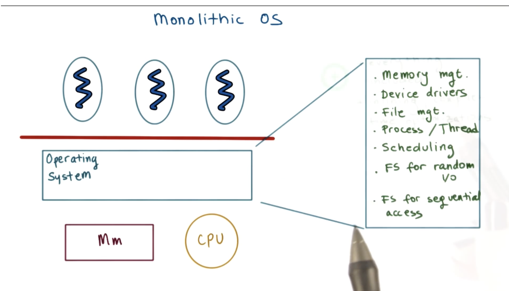
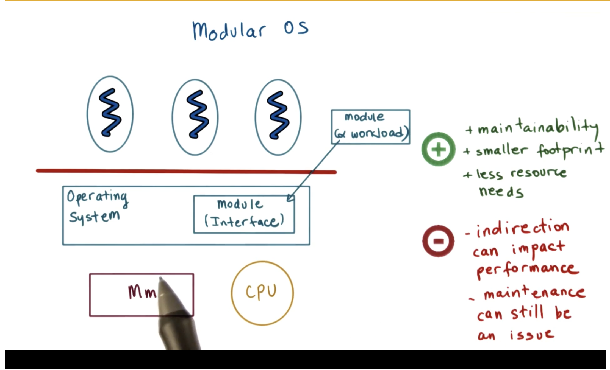
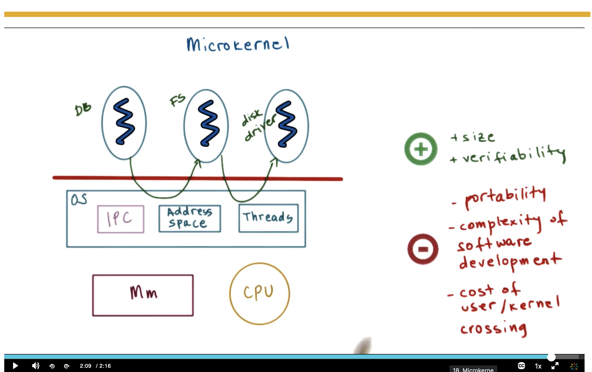
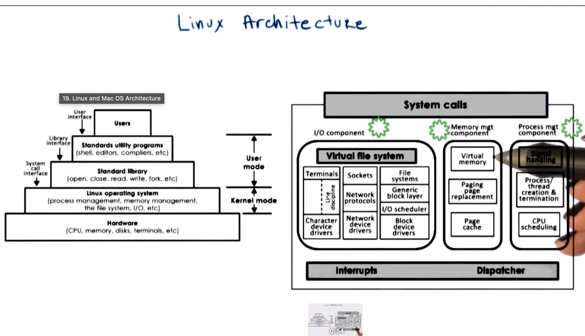
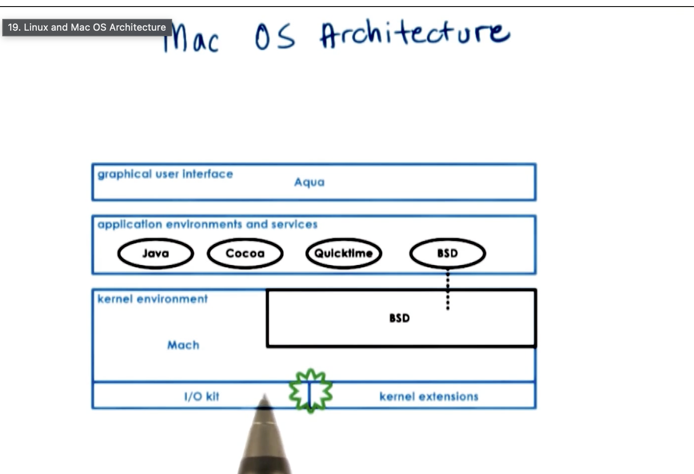

# P1L2 — Introduction to Operating Systems

## Overview

Operating systems can be designed in different architectural styles. The main trade-off is between **performance** (keeping services close together in kernel space) and **flexibility / isolation** (pushing services into modules or user space).

This lecture covers three classic designs, then looks at how **Linux** and **macOS** realize them in practice.

| Architecture | Core idea | Typical examples |
|---|---|---|
| Monolithic | All major OS services live in one large kernel | Traditional Unix, early Linux |
| Modular | Kernel + loadable modules with well-defined interfaces | Modern Linux (loadable kernel modules) |
| Microkernel | Minimal kernel; most services run in user space | Mach, QNX, MINIX 3, L4 |

---

## 1. Monolithic OS

In a **monolithic** design, nearly everything the OS does lives in a single kernel address space: memory management, device drivers, file systems, process/thread management, scheduling, and I/O.

User processes sit above a privilege boundary; the kernel talks directly to hardware (CPU, memory).

### What runs in the kernel

| Component | Role |
|---|---|
| Memory management | Allocate/free physical & virtual memory |
| Device drivers | Talk to disks, network cards, terminals, etc. |
| File management | Organize and access stored data |
| Process / thread management | Create, destroy, and track execution contexts |
| Scheduling | Decide which process/thread runs on the CPU |
| File systems (random I/O) | Support seekable access patterns |
| File systems (sequential access) | Optimize streaming / sequential workloads |

### Benefits

| Benefit | Why it matters |
|---|---|
| Everything is included | One integrated binary; no need to piece services together |
| Inline / direct calls | Kernel components call each other as normal functions (no IPC hop) |
| Time optimization | Low overhead for common paths (syscalls, I/O, scheduling) |

### Downsides

| Downside | Why it hurts |
|---|---|
| Customization | Hard to swap out one subsystem without rebuilding / risking the whole kernel |
| Portability | Tight coupling to a specific hardware/platform model |
| Manageability | Large, complex codebase; bugs in one part can crash the whole system |
| Memory footprint | Full kernel must be loaded even if you only need a subset of services |
| Performance (under load / scale) | A huge shared address space can hurt cache locality and make tuning hard |
| Large memory requirement | Everything lives together; cannot easily drop unused services |

---

## 2. Modular OS

A **modular** OS keeps a core operating system, but factors major pieces into **modules** that plug in through a defined **module interface**. Workloads (applications) use those modules; modules can often be loaded, unloaded, or replaced without rewriting the entire OS.

### Key ideas

1. **Easy customization** — pick the modules you need.
2. **Configurable subsystems** — choose which file system, scheduler, or driver the OS uses.
3. **Dynamic installation** — install or remove modules at runtime (e.g., loadable kernel modules).

### Pros and cons

| | Notes |
|---|---|
| **+ Maintainability** | Smaller, clearer units; easier to update one piece |
| **+ Smaller footprint** | Load only what you need |
| **+ Lower resource needs** | Unused modules stay out of memory |
| **− Indirection** | Extra interface layer can add overhead vs. direct monolithic calls |
| **− Maintenance still matters** | Module APIs and versioning can become complex |

### Monolithic vs modular (quick compare)

| Aspect | Monolithic | Modular |
|---|---|---|
| Coupling | Tight; all-in-one | Looser; via module interfaces |
| Extensibility | Rebuild / patch kernel | Load/replace modules |
| Footprint | Larger fixed size | Can be smaller / on-demand |
| Call path | Direct function calls | May go through interfaces / indirection |
| Failure isolation | Weak (one bug → whole kernel) | Better for *some* faults, still often in kernel |

---

## 3. Microkernel

A **microkernel** keeps only the most fundamental services in the kernel. Everything else — databases, file systems, device drivers — runs as **user-level servers**.

Typical microkernel primitives:

| Primitive | Purpose |
|---|---|
| IPC | Message passing between user-level servers and clients |
| Address space management | Protect and map memory for processes |
| Threads | Basic execution contexts |

Applications talk to servers (DB, FS, disk driver) via IPC; the tiny OS core mediates and manages hardware (CPU, memory).

### Pros and cons

| | Notes |
|---|---|
| **+ Size** | Very small trusted computing base |
| **+ Verifiability** | Easier to reason about / formally verify a tiny kernel |
| **+ Isolation** | A crashing FS or driver need not take down the whole machine |
| **− Portability** | Still non-trivial; hardware abstractions and IPC models differ |
| **− Development complexity** | Building correct, efficient user-level servers is hard |
| **− User/kernel crossing cost** | Extra IPC and mode switches vs. monolithic in-kernel calls |

### Where services live

| Service | Monolithic / modular (typical) | Microkernel (typical) |
|---|---|---|
| Process / thread basics | Kernel | Kernel |
| IPC / address spaces | Kernel | Kernel |
| File system | Kernel (or module) | User-level server |
| Device drivers | Kernel (or module) | User-level server |
| Database / higher services | User space | User space |

---

## 4. Comparison summary

| Criterion | Monolithic | Modular | Microkernel |
|---|---|---|---|
| Kernel size | Large | Medium (core + modules) | Small |
| Performance (common path) | Excellent | Good | Often slower (IPC) |
| Customization | Poor | Strong | Strong (swap servers) |
| Fault isolation | Weak | Moderate | Strong |
| Footprint control | Weak | Strong | Strong |
| Verifiability | Hard | Harder than micro | Best |
| Example systems | Classic Unix | Linux LKMs | Mach, QNX, MINIX 3 |

---

## 5. Linux Architecture

Linux is often described as a **monolithic kernel with modular extensions**: major subsystems live in kernel space, but many can be individually modified, replaced, or loaded as modules.

Each component in the kernel can be individually modified or replaced (within the kernel’s module / subsystem model).

### Layered view (user → hardware)

| Layer | Contents | Interface |
|---|---|---|
| Users | People / applications | User interface |
| Standard utilities | Shell, editors, compilers, etc. | Library interface |
| Standard library | `open`, `close`, `read`, `write`, `fork`, … | System call interface |
| Linux OS (kernel mode) | Process mgmt, memory mgmt, file system, I/O, … | — |
| Hardware | CPU, memory, disks, terminals, … | — |

### Kernel internals (via system calls)

| Component | Responsibilities |
|---|---|
| **I/O / VFS** | Virtual file system, terminals, sockets, file systems, generic block layer, network protocols, I/O scheduler, character / block / network drivers |
| **Memory management** | Virtual memory, paging / block replacement, page cache |
| **Process management** | Signal handling, process/thread create & terminate, CPU scheduling |
| **Interrupts** | Hardware events enter the kernel |
| **Dispatcher** | Routes work to the right subsystem |

---

## 6. macOS Architecture

macOS (historically Mac OS X) uses a **hybrid** design: a Mach-based kernel environment combined with a BSD Unix layer, plus frameworks above for applications and UI.

### Layers (top → bottom)

| Layer | Components | Notes |
|---|---|---|
| GUI | **Aqua** | Graphical user interface |
| Application environments & services | **Java**, **Cocoa**, **QuickTime**, **BSD** | App frameworks and Unix userland services |
| Kernel environment | **Mach** + **BSD** | Mach provides microkernel-style primitives; BSD adds Unix process/FS semantics |
| Low-level I/O | **I/O Kit**, **kernel extensions** | Drivers and extensible kernel modules |

### How it relates to the earlier designs

| Idea | How macOS uses it |
|---|---|
| Microkernel influence | Mach roots (IPC, tasks/threads, address spaces) |
| Monolithic / hybrid reality | Many services (esp. BSD) live in the same kernel for performance |
| Modularity | Kernel extensions (kexts) / driver kits extend the kernel |

---

## Quick takeaways

1. **Monolithic** optimizes for speed and integration; pays in size, customization, and blast radius of bugs.
2. **Modular** keeps a kernel core but lets you plug in FS, schedulers, and drivers — better footprint and flexibility, with some indirection cost.
3. **Microkernel** minimizes the trusted base and isolates services in user space — great for reliability/verifiability, costly in IPC and development complexity.
4. **Linux** ≈ modular monolithic kernel; **macOS** ≈ Mach + BSD hybrid with rich user frameworks (Aqua, Cocoa, …).
