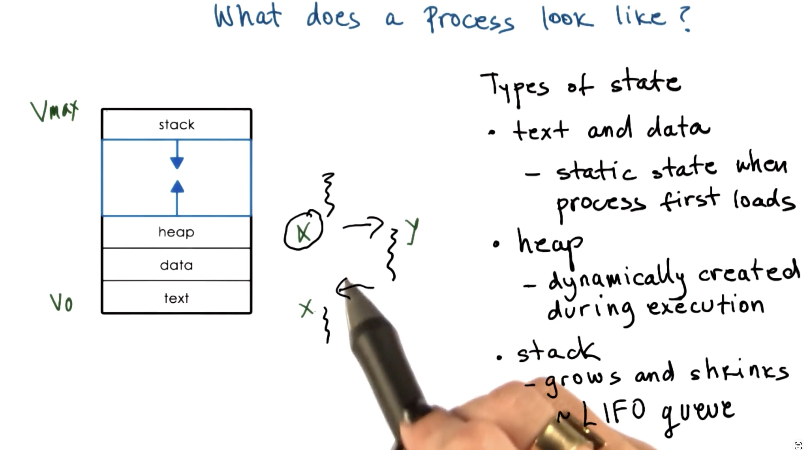
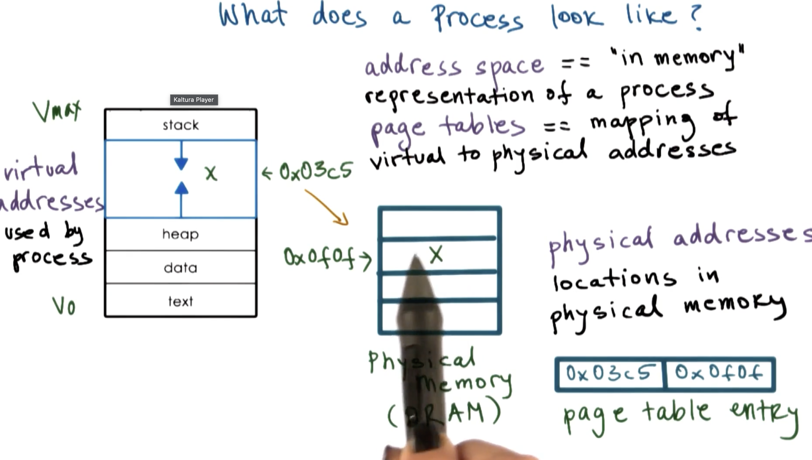
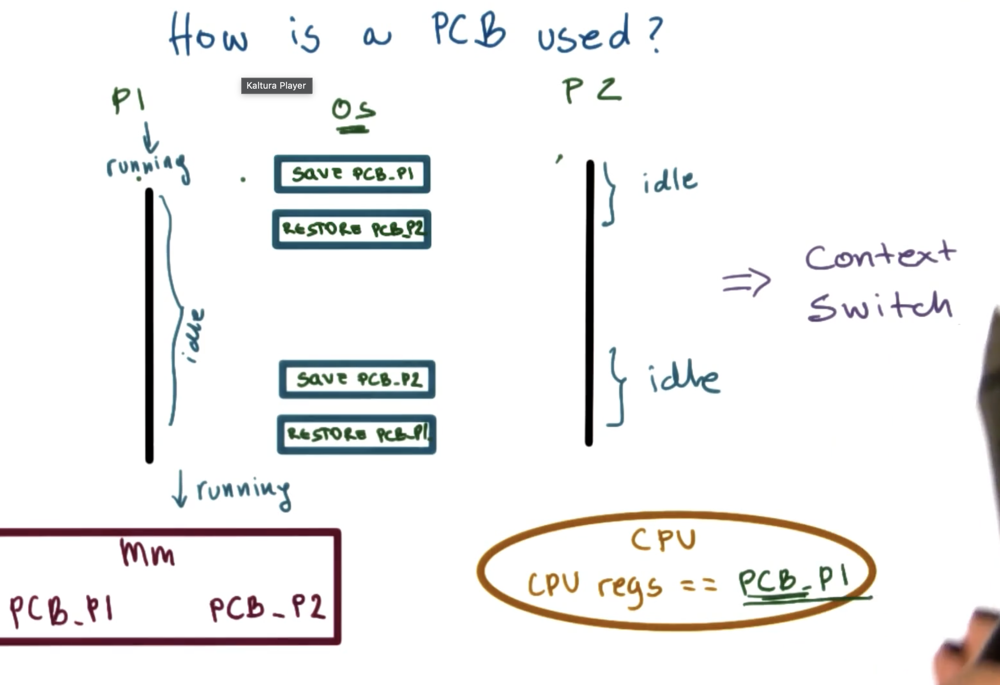
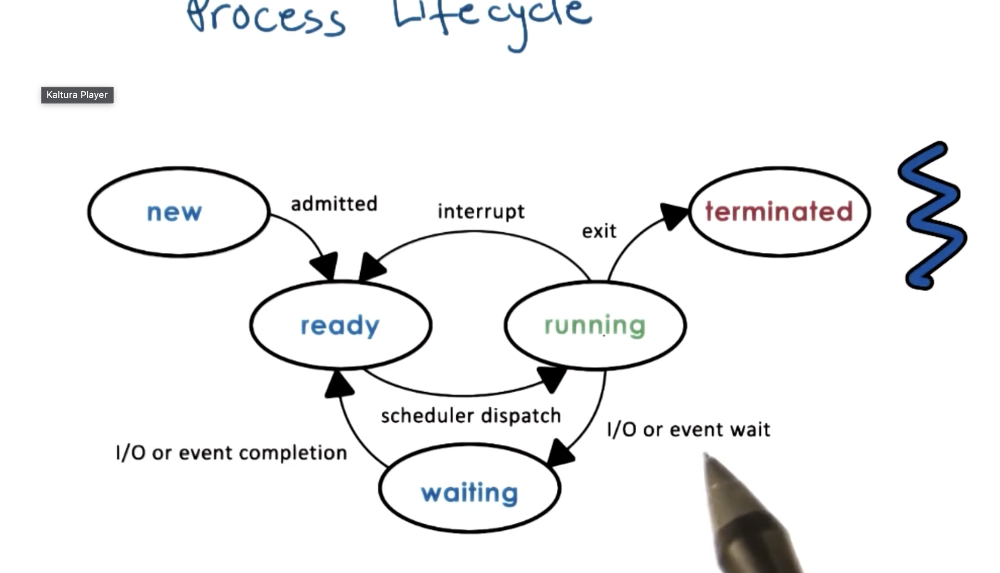
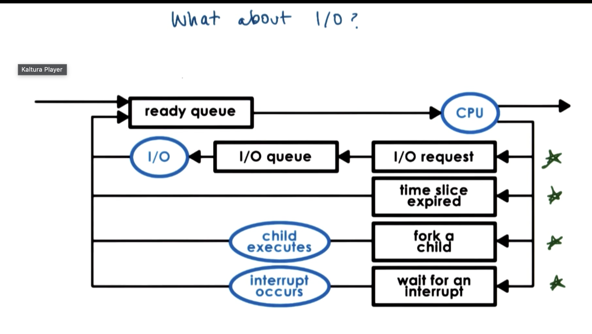
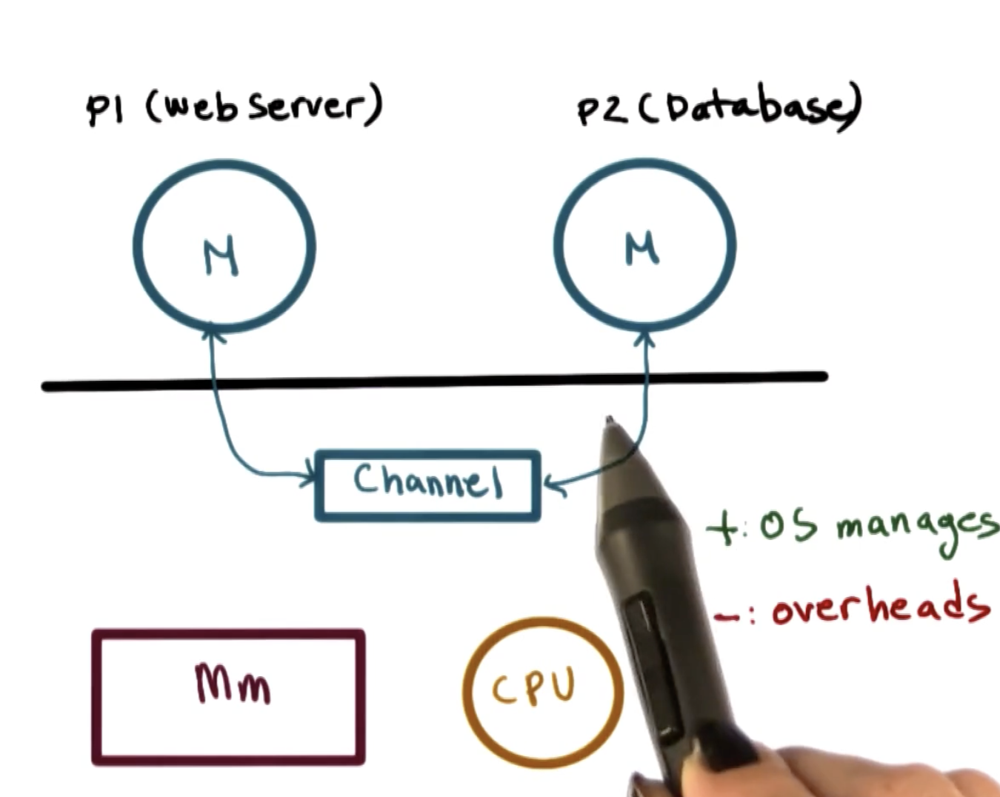

# P2L2 — Process and Process Management

## Overview

A **process** is the key abstraction an operating system supports. The OS manages hardware on behalf of applications; a process is the *active* representation of a program while it runs.

| Term | Meaning |
|---|---|
| Program | Static entity on disk (binary / executable) |
| Process | Dynamic entity: a program loaded into memory and executing |
| Task / Job | Often used interchangeably with process |

If the same program is launched multiple times, the OS creates **multiple processes** (separate address spaces, PCBs, and execution state).

---

## 1. What Is a Process?

A process is an **instance of an executing program**. It encapsulates everything needed to run that program.

### What a process contains

| Component | Examples | Role |
|---|---|---|
| Execution state | Program counter (PC), stack pointer, CPU registers | Where the process is in its instruction stream |
| Memory / data | Text, data, heap, stack; temporary holding areas | Code and working storage |
| OS-managed resources | Open files, signal masks, I/O devices | Special hardware and kernel objects the process may need |

### Program vs process

| | Program | Process |
|---|---|---|
| Location | Disk | Memory (while running) |
| Nature | Static | Active / dynamic |
| Count | One binary | Many instances possible |
| Managed by | File system | OS (PCB, scheduler, MMU) |

---

## 2. What Does a Process Look Like?

Every element a process needs is identified by its **memory**. The OS abstraction that encapsulates process state is the **address space**, typically defined from virtual address **V0** to **Vmax**.

### Types of state (memory segments)

| Segment | When created | Behavior | Typical contents |
|---|---|---|---|
| **Text** | Loaded at process start | Static (usually read-only / executable) | Machine instructions |
| **Data** | Loaded at process start | Static (initialized globals, etc.) | Global / static variables |
| **Heap** | During execution | Grows / shrinks dynamically (e.g. `malloc`) | Dynamically allocated objects |
| **Stack** | During execution | Grows / shrinks (LIFO); often used on context save | Function frames, locals, return addresses |

Stack and heap typically grow toward each other in the virtual address space (stack from high addresses downward; heap from low addresses upward).

---

## 3. Virtual Memory and Address Spaces

Addresses from **V0** to **Vmax** are **virtual** — they do not correspond 1:1 to physical DRAM locations. The OS uses **page tables** to map virtual → physical addresses. That keeps physical memory management simple and hidden from the process.

### Key ideas

| Concept | Meaning |
|---|---|
| Address space | In-memory representation of a process |
| Page tables | Mapping of virtual addresses to physical addresses |
| Physical addresses | Actual locations in DRAM |
| Sparse layout | Not all of V0–Vmax is mapped; gaps are normal |
| Demand paging | Parts of a process may live in memory or on disk based on use |
| Protection | OS checks whether a process is allowed a given memory access |

Example mapping from the lecture: virtual `0x03c5` → physical `0x0f0f` via a page-table entry.

---

## 4. How the OS Tracks What a Process Is Doing

Hardware and the OS together keep execution state:

| Hardware / OS field | Role |
|---|---|
| **Program counter (PC)** | Address of the next instruction (CPU register) |
| **CPU registers** | Working values for the running process |
| **Stack pointer (SP)** | Top of the current stack |
| **Process Control Block (PCB)** | Kernel data structure holding the full process snapshot |

---

## 5. Process Control Block (PCB)

A **PCB** is the data structure the OS maintains for **every** process it manages. It is created when the process is created; the program counter is set to the first instruction. Some fields update when process state changes; others (like the PC) are updated by the CPU as instructions execute.

### Typical PCB contents

| Field | Purpose |
|---|---|
| Process state | new / ready / running / waiting / terminated |
| Process number (PID) | Unique identifier |
| Program counter | Next instruction to execute |
| CPU registers | Saved register set for context switch |
| Memory limits | Base / limit, page-table info, etc. |
| Open files | File descriptors / handles |
| Priority | Scheduling priority |
| Signal mask | Which signals are blocked / pending |
| CPU scheduling info | Time slice remaining, queue membership, etc. |

### How the PCB is used (context switch)

With two processes P1 and P2:

1. While **P1** runs, CPU registers hold P1’s state.
2. When P1 is interrupted / goes idle, the OS **saves** that state into **PCB.P1**.
3. The OS **restores PCB.P2** into the CPU registers; P2 runs.
4. Later, P2 is saved and P1 is restored — P1 resumes at the exact point it was interrupted.

| Step | Action |
|---|---|
| Save | Copy CPU registers → PCB of current process |
| Schedule | Choose next ready process |
| Restore | Copy PCB of next process → CPU registers |
| Resume | Continue execution as if never interrupted |

---

## 6. Context Switch

A **context switch** is switching the CPU from the context of one process to another.

| Cost type | What it includes |
|---|---|
| **Direct** | CPU cycles for load/store of registers and PCB updates |
| **Indirect** | Cold cache, TLB misses, pipeline flush — later work runs slower |

Because context switches are expensive, the OS must **limit how often** they occur (balanced against fairness and responsiveness).

---

## 7. Process Lifecycle

A process is either making progress on the CPU or waiting (idle from the CPU’s perspective). Classic five-state model:

### States

| State | Meaning |
|---|---|
| **New** | Process is being created |
| **Ready** | Waiting to be assigned to a CPU (resources admitted) |
| **Running** | Instructions are executing on the CPU |
| **Waiting** | Blocked for I/O or an event |
| **Terminated** | Finished or killed; resources being reclaimed |

### State transitions

| From | Event | To |
|---|---|---|
| new | admitted | ready |
| ready | scheduler dispatch | running |
| running | interrupt / time slice expired | ready |
| running | I/O or event wait | waiting |
| waiting | I/O or event completion | ready |
| running | exit | terminated |

---

## 8. Process Creation

Processes form a **tree**: a root process creates children; those children can create further children.

| Scenario | What happens |
|---|---|
| User logs in | A **shell** process is created |
| User runs `ls` | Shell creates a **child** process for the command |
| Unix / Linux | **`init`** (or `systemd`) is often the ancestor of user processes |
| Android | **Zygote** is the parent daemon used to launch app processes |

### Mechanisms: `fork` and `exec`

| Mechanism | What it does |
|---|---|
| **`fork`** | Copies parent PCB → new child PCB; child continues at the instruction *after* `fork` |
| **`exec`** | Replaces the child’s address space with a new program image; starts at the first instruction of that program |

Typical pattern: `fork` to create a child, then `exec` in the child to run a different program (e.g., the shell spawning `ls`).

---

## 9. Role of the CPU Scheduler

Only processes in the **ready** state are candidates to run. The **CPU scheduler** decides **which** ready process runs next and **for how long**.

### Scheduling steps

| Step | Action |
|---|---|
| 1. Preempt | Interrupt current process; save its context (PCB) |
| 2. Schedule | Run the scheduling algorithm; pick the next process |
| 3. Dispatch | Restore that process’s PCB and run it |

### Time slice and efficiency

| Symbol | Meaning |
|---|---|
| \(T_p\) | Time slice allocated to a process (useful work) |
| \(T_s\) | Time spent in the scheduler / switch overhead |

For an alternating pattern of work and scheduling, useful CPU efficiency is approximately:

\[
\frac{2 T_p}{2 T_p + 2 T_s} = \frac{T_p}{T_p + T_s}
\]

| Relationship | Approximate efficiency |
|---|---|
| \(T_p = 10 \times T_s\) | ~91% |
| \(T_p = T_s\) | ~50% (too much overhead) |
| \(T_p \gg T_s\) | Higher efficiency, but worse interactive latency |

### Scheduling design decisions

| Decision | Question |
|---|---|
| Time slice length | Short → responsive but more switches; long → efficient but less interactive |
| Selection metric | Priority, fairness, deadlines, I/O vs CPU intensity, etc. |

---

## 10. What About I/O?

CPU-bound and I/O-bound work interact through queues. A process may leave the CPU for I/O, a fork, an interrupt, or because its time slice expired — then re-enter the ready (or I/O) queue later.

| Path | Typical flow |
|---|---|
| Ready → CPU | Scheduler dispatches a ready process |
| I/O request | Process moves to an **I/O queue**; later returns to ready when I/O completes |
| Time slice expired | Back to ready queue |
| Fork a child | Child may execute; parent/child scheduling continues |
| Wait for interrupt | Process waits until the interrupt / event occurs |

Overlapping I/O of one process with CPU work of another is a major reason multiprogramming improves utilization.

---

## 11. Inter-Process Communication (IPC)

Processes have isolated address spaces. **IPC** lets them interact while the OS still maintains protection.

### Goals of IPC

| Goal | Why |
|---|---|
| Transfer data / information | Share results across address spaces |
| Maintain protection & isolation | One buggy process should not freely corrupt another |
| Flexibility & performance | Support many patterns without unnecessary cost |

### Message-passing IPC

The OS provides a **communication channel** (e.g., shared kernel buffer, pipe, socket). Processes **send** / **recv** messages through that channel.

| | Notes |
|---|---|
| **+** | OS manages the channel; simpler synchronization model for many cases |
| **−** | Overhead of copying: process → channel → process |

Example from lecture: a web server process and a database process exchanging data via a channel, with memory and CPU still managed by the OS.

### Shared-memory IPC

| | Notes |
|---|---|
| Setup | OS establishes a shared region and maps it into each process’s address space |
| Data path | Processes read/write the region **directly** (OS out of the hot path) |
| **+** | High performance; no per-message kernel copy |
| **−** | Error-prone; apps must re-implement synchronization (locks, barriers, etc.) |

### Message passing vs shared memory

| Aspect | Message passing | Shared memory |
|---|---|---|
| Data movement | Via OS channel (copies) | Direct in shared pages |
| OS involvement | High (per send/recv) | Mostly at setup |
| Ease of use | Often simpler API | Requires careful sync |
| Performance | Higher overhead | Usually faster |
| Isolation | Stronger (OS mediates) | Weaker (shared writable memory) |

---

## Quick takeaways

1. A **process** is a running program plus its state; the same binary can yield many processes.
2. Process state lives in a **virtual address space** (text, data, heap, stack) mapped to physical memory via **page tables**.
3. The **PCB** holds everything needed to stop and resume a process; swapping PCBs is the heart of a **context switch**.
4. Processes move through **new → ready → running**, with detours through **waiting** for I/O and eventual **termination**.
5. Creation commonly uses **`fork` + `exec`**; schedulers balance **time-slice length** against switch overhead.
6. **IPC** is either **message passing** (OS-mediated, safer, slower) or **shared memory** (fast, harder to use correctly).
