# P2L2 — Threads and Concurrency

## Overview

A **process** is one program in its own address space. A **thread** is a sequential flow of control *inside* that address space. One process can have many threads; they share memory, open files, and other process resources, but each thread has its own program counter, registers, and stack.

This lecture follows Georgia Tech CS-6200 (P2L2) and is enriched with ideas from Andrew D. Birrell, *An Introduction to Programming with Threads* (DEC SRC Research Report 35, 1989). Birrell’s paper is a practical tutorial: how to *use* thread primitives correctly, not how a kernel implements them.

| Idea | Meaning |
|---|---|
| Thread | One sequential point of execution (Birrell: “a single sequential flow of control”) |
| Multi-threaded program | Multiple points of execution at once, synchronizing through **shared memory** |
| Lightweight | Create / switch / destroy / wait should be cheap enough to use for ordinary concurrency |
| Not automatic parallelism | Threads are not a compiler that splits sequential code onto many CPUs; *you* decide when to `Fork` |

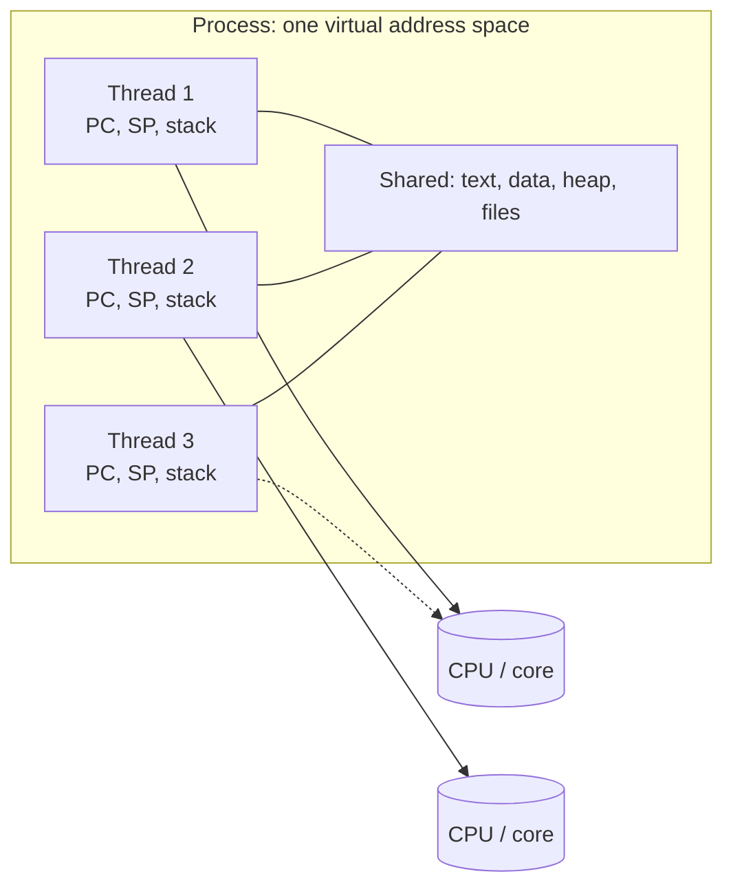

---

## 1. From One Context to Many

**Starting point:** a single process with a **single execution context** (one PC, one stack, one register set).

**Threads** are the *active* units that execute inside a process. Many threads can run at the same time (or appear to, via time-slicing). They must **coordinate** because they share:

| Shared resource | Why coordination is required |
|---|---|
| CPUs | Only one thread per core at a time; scheduler multiplexes |
| Memory | Same virtual addresses; races if two threads write the same object |
| I/O devices | Ordering, buffers, and exclusive use of some devices |

The OS still isolates **processes** from each other. It does **not** isolate threads of the same process: they *intentionally* share the address space.

---

## 2. Process vs Thread

| | Process | Thread |
|---|---|---|
| Address space | Private virtual memory | Shares the process’s virtual memory |
| Execution state | PCB: PC, registers, SP, plus OS resources | TCB / thread object: PC, registers, SP, stack, attributes |
| Creation cost | High (address space, page tables, files) | Lower (mostly a stack + a control block) |
| Isolation | OS prevents sharing unless IPC is set up | No isolation by default — programmer must synchronize |
| Communication | IPC (messages or explicit shared segments) | Direct loads/stores of globals / heap |
| Failure domain | Crash usually kills one process | A bad thread can corrupt the whole process |

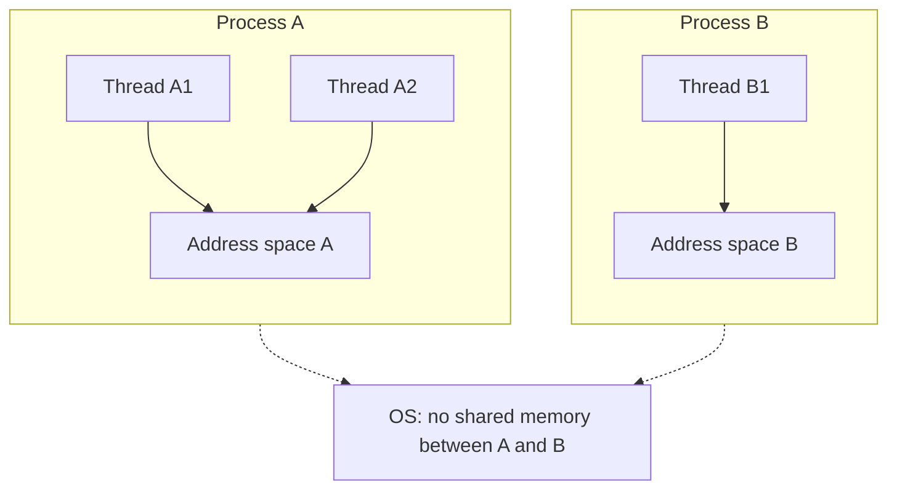

**Birrell’s wording:** “process” = one flow of control **paired 1:1 with an address space**. “Thread” = extra flows **inside** that space. Off-stack (global) variables are shared; each thread has its own call stack and locals.

---

## 3. Why Use Concurrency? (Lecture + Birrell)

Life is simpler without threads. Birrell lists the pressures that make them worth it:

| Source of concurrency | What threads buy you |
|---|---|
| **Multi-processors** | Real simultaneous execution; cheaper than one OS process per core |
| **Slow devices** | Disk, net, terminal, printer: other threads work while one waits |
| **Human users** | Window systems often `Fork` a thread per click so the UI stays live |
| **Network servers** | One server handles many clients in parallel (file / print / RPC) |
| **Latency hiding** | Return to the caller, finish leftover work (e.g. rebalance a tree) in a background thread |

Even on a **uniprocessor**, extra threads can improve *responsiveness* even if total CPU work is the same: useful work is overlapped with idle time.

### Multi-CPU / parallel speedup

1. **Parallelism** — independent work on different cores.
2. **Different code paths** — threads need not run the same procedure.
3. **Specialization / hot cache** — a thread that always does the same kind of work keeps its working set warm.
4. **Cheaper than multi-process** — less memory; sharing data is a pointer, not an IPC protocol.

### Single CPU: hide idle time

Context-switching threads still costs time. Multi-threading on one CPU is worthwhile when idle time is large compared with two switches (leave the idle thread, run another, later switch back):

\[
t_{\text{idle}} \;>\; 2 \cdot t_{\text{ctx\_switch}}
\]

| Quantity | Meaning |
|---|---|
| \(t_{\text{idle}}\) | Time a thread would sit blocked (I/O, lock, network) |
| \(t_{\text{ctx\_switch}}\) | Cost to switch **threads** (usually less than a **process** switch) |

```mermaid
gantt
  title Overlapping idle time on one CPU
  dateFormat X
  axisFormat %s
  section Thread A
  Compute     :a1, 0, 3
  I/O wait    :crit, a2, 3, 10
  Compute     :a3, 10, 13
  section Thread B
  Idle        :b0, 0, 3
  Compute     :b1, 3, 10
  Idle        :b2, 10, 13
```

Thread-to-thread switches are cheaper than process-to-process switches (no full address-space change). That is why threads are a good way to **hide idle time** even with one CPU.

### Benefits to the OS itself

Threads are not only an application idea:

- Application threads run *on behalf of* user programs.
- Kernel services (daemons, some drivers) are themselves threaded.

---

## 4. What Support Do Threads Need?

| Need | Role |
|---|---|
| Data structures | Track each thread’s CPU state, stack, and resource use (TCB) |
| Create / manage | `Fork` / `Join` (or `pthread_create` / `pthread_join`) |
| Safe coordination | Mutexes and condition variables in a **shared** address space |

Processes: the OS **prevents** accidental sharing. Threads: the **programmer** must prevent unsafe sharing.

---

## 5. Shared Address Space and Races

Threads \(T_1\) and \(T_2\) use the **same** virtual memory. Concurrent unsynchronized writes to the same object are **data races**.

Classic list-insert race (lecture + Birrell’s linked-list `LOCK` example):

```text
create element e
e.value   = X
e.next    = list.head      // read shared head
list.head = e              // write shared head
```

If two threads interleave after both have read the old `head`, **one insert is lost**.

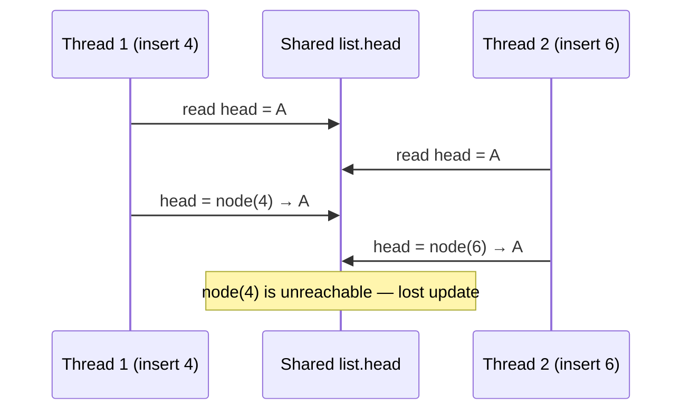

Birrell’s rule: **all shared mutable data must be associated with a mutex**, and accessed only while that mutex is held. Timing depends on page faults, timers, and true multiprocessor interleaving — races are **non-deterministic**.

---

## 6. Thread Control Block and Thread Creation

### What a thread object holds

| Field | Purpose |
|---|---|
| Thread ID | Handle returned by `Fork` |
| PC, registers | Execution state |
| Stack pointer + stack | Private call stack / locals |
| Attributes | Priority, stack size, detach state, … |

### Birrell / SRC primitives (lecture API)

Birrell’s Topaz/SRC facility (Modula-2+). The lecture uses the same names. **This `Fork` is not Unix `fork()`.**

| Primitive | Meaning |
|---|---|
| `Fork(proc, args)` | Create a thread that **asynchronously** starts `proc(args)`. When `proc` returns, the thread dies. |
| `Join(thread)` | Wait until that thread terminates; return the result of its initial procedure |

```text
t := Fork(a, x)     // child runs a(x) in parallel
p := b(y)           // parent runs b(y)
q := Join(t)        // q = result of a(x)
```

Birrell’s notes on `Join`:

- At SRC, **`Join` is not used much**. Many threads are permanent daemons, have no result, or publish results through a mutex/condition instead.
- If the initial procedure has returned and nobody `Join`s, the thread **quietly evaporates**.
- Some systems omit `Join` as a primitive.

### Lecture example: concurrent list inserts

```text
shared_list list;
thread1 = Fork(safe_insert, 4)
safe_insert(6)
Join(thread1)
```

Final order in the list may be **4 then 6** or **6 then 4**. `Join` only waits for completion; it does **not** serialize the inserts unless `safe_insert` takes a mutex.

---

## 7. Mutual Exclusion (Mutexes)

A **mutex** serializes access: at most one thread holds it. The protected region is a **critical section**.

### Mutex state

| Field | Role |
|---|---|
| Status | locked / unlocked (initially unlocked) |
| Owner | Which thread holds it (if tracked) |
| Blocked threads | Queue of waiters |

Birrell: a mutex is a tiny **scheduler** whose resource is “the shared memory inside the `LOCK`” and whose policy is **one thread at a time**. This is the practical core of Hoare **monitors**: data + mutex + (later) condition variables.

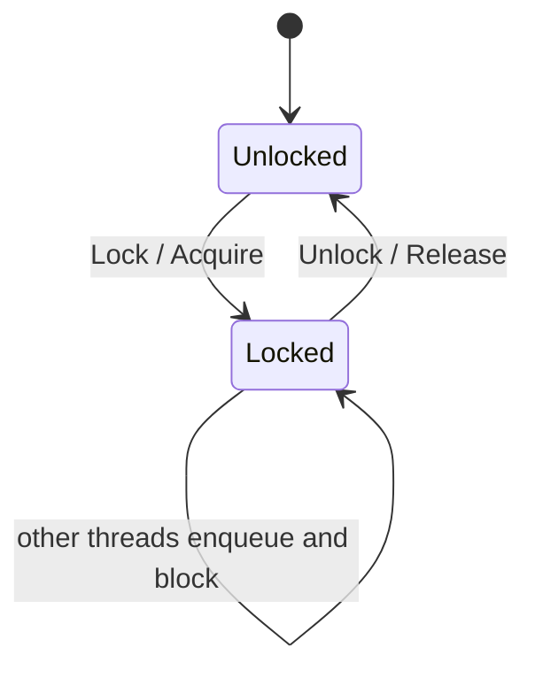

### Critical section (list insert, serialized)

```text
LOCK mutex DO
    e.next    = list.head
    list.head = e
END
```

Only one thread at a time executes the two pointer writes, so no insert is lost.

**Granularity (Birrell):**

| Style | Example | Trade-off |
|---|---|---|
| Coarse | One mutex for a whole module | Simple; more lock conflict |
| Per object | Mutex inside each `File` record | Parallel writes to different files |
| Packed fields | Two mutexes on bitfields in one word | Can tear; avoid unless the language/hardware is atomic |

**Invariants:** treat the mutex as protecting a **boolean invariant** of the data. The invariant is true whenever the mutex is **not** held. Restore it before `Unlock` and before `Wait` (because `Wait` unlocks).

**Cheating:** skipping the mutex for a “simple integer” is machine-dependent and usually wrong. A safer cheat is a **hint** (e.g. double-checked init): unsynchronized read that is either correct or leads you into a locked, correct path.

---

## 8. Condition Variables (Scheduling, Not Just Exclusion)

Mutexes answer “**who** may touch this data?” Condition variables answer “**when** is the data in a state I can proceed?”

Producer/consumer: processing under the mutex should happen **only when a predicate is true** (buffer not empty / not full).

### API (lecture = Birrell SRC)

| Call | Effect |
|---|---|
| `Wait(mutex, cond)` | **Atomically** release the mutex, block on `cond`, later re-acquire the mutex and return |
| `Signal(cond)` | Wake **at least one** waiter (SRC may rarely wake more than one) |
| `Broadcast(cond)` | Wake **all** waiters |

Condition variable contents: a list of waiting threads, always used with **the same mutex** and the data that mutex protects.

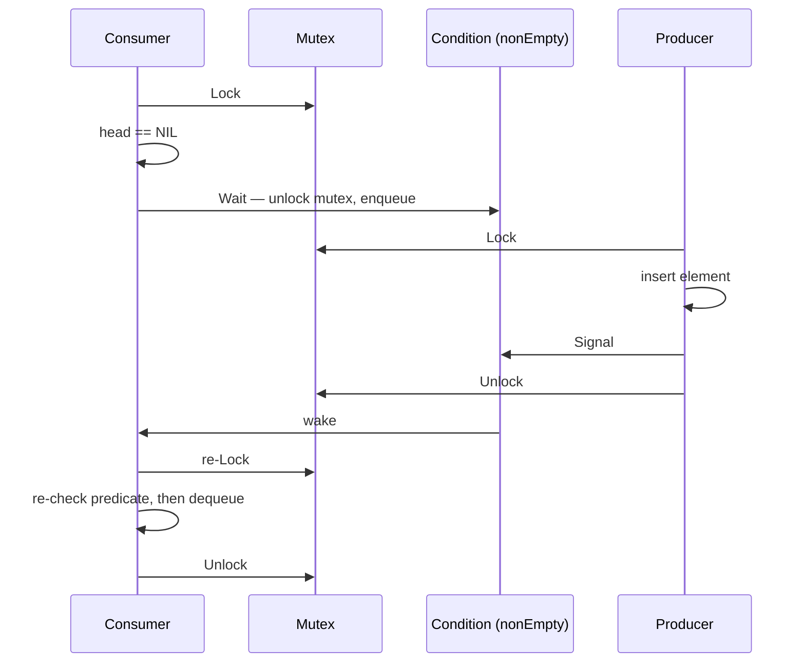

Atomic `Wait` avoids the **wake-up waiting race**: signal cannot be lost between “I saw empty” and “I blocked.”

### Canonical wait loop (Birrell — always do this)

```text
LOCK m DO
    WHILE NOT predicate DO
        Wait(m, cond)
    END
    // predicate is true; update state; Signal/Broadcast as needed
END
```

Why re-test after wake-up?

| Reason | Detail |
|---|---|
| Another waiter stole the resource | Mesa/SRC semantics: the waker does **not** hand the mutex to you |
| Extra wake-ups | SRC `Signal` may wake more than one thread |
| Local reasoning | Correctness is visible at the wait site, not by auditing every `Signal` |
| Extra signals are benign | Over-signaling is a **performance** issue, not a **correctness** issue |

Hoare’s original conditions would make the re-test unnecessary; Mesa/SRC/POSIX-style conditions are simpler to implement, so **always loop**.

### `Signal` vs `Broadcast`

| | Use when |
|---|---|
| `Signal` | At most one waiter can make progress (e.g. one consumer, one slot) |
| `Broadcast` | Many waiters can proceed, or you want simpler code (wake everyone; they re-check) |

If you always re-check the predicate, replacing `Signal` with `Broadcast` cannot break correctness — it can only add scheduler work (**spurious wake-ups**).

---

## 9. Producer / Consumer

Shared unbounded list, mutex `m`, condition `nonEmpty`:

| Role | Under the lock |
|---|---|
| **Consume** | `WHILE head = NIL DO Wait(m, nonEmpty)`; then pop |
| **Produce** | Push; `Signal(nonEmpty)` |


Bounded buffers add a second condition (`notFull`) so producers wait when the queue is full — the same pattern with a different predicate.

---

## 10. Readers / Writers

**Rules**

| Role | Allowed together |
|---|---|
| Readers | 0 or more concurrent readers |
| Writers | 0 or 1 writer, and **no** readers |

A single mutex around the *data* is correct but **too restrictive**: readers could share. Mutexes are binary (held / not). The lecture (and Birrell’s shared/exclusive locking) add a **counter** plus conditions.

### Shared resource state

| `resource_counter` | Meaning |
|---|---|
| \(0\) | Free |
| \(> 0\) | That many readers |
| \(-1\) | One writer |

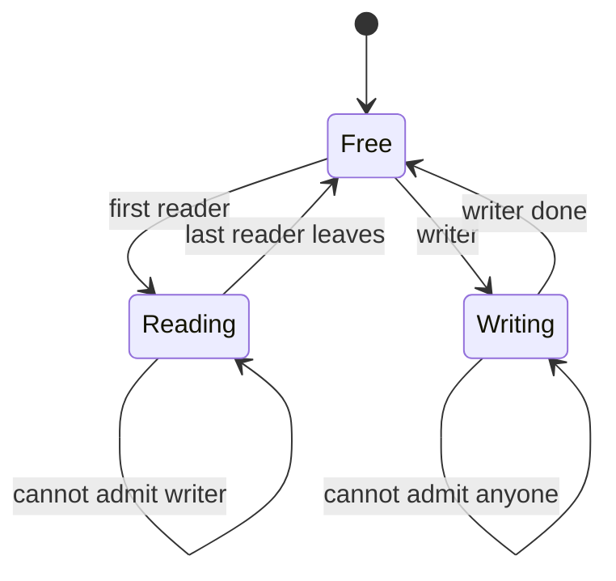

### Lecture encoding (two conditions: `read_phase`, `write_phase`)

**Reader**

```text
Lock(counter_mutex)
    while resource_counter == -1:
        Wait(counter_mutex, read_phase)
    resource_counter++
Unlock
// ... read data ...
Lock(counter_mutex)
    resource_counter--
    if resource_counter == 0:
        Signal(write_phase)    // last reader: a writer may proceed
Unlock
```

**Writer**

```text
Lock(counter_mutex)
    while resource_counter != 0:
        Wait(counter_mutex, write_phase)
    resource_counter = -1
Unlock
// ... write data ...
Lock(counter_mutex)
    resource_counter = 0
    Broadcast(read_phase)     // many readers may start
    Signal(write_phase)       // or one other writer
Unlock
```

Birrell’s first version uses **one** condition and `Broadcast` on writer release; a later version splits reader vs writer queues to cut **spurious wake-ups**. Writer **starvation** is possible if readers keep arriving (`i` never hits 0). Fix: new readers wait if a writer is already queued.

### General monitor pattern

```text
Lock(mutex)
    while not predicate_indicating_access_ok:
        Wait(mutex, cond_var)
    update state   // which updates the predicate
    Signal and/or Broadcast the waiters who might now proceed
Unlock
```

---

## 11. Spurious Wake-Ups and Lock Conflicts

**Spurious wake-up:** a thread is awakened even though it **still cannot** proceed (wrong condition, `Broadcast` too wide, or Mesa extra wake).

The wait **loop** makes this safe. Reducing spurious wakes is for **performance**.

### Lecture pitfall: signal while still holding the mutex

If a writer does `Broadcast` / `Signal` **inside** the lock, a woken reader may run on another CPU, execute a few instructions, then **block again on the mutex** the writer still holds — two extra reschedules.

**Better (lecture “new writer” + Birrell):** update the counter under the lock; **signal after unlock**.

```text
Lock(counter_mutex)
    resource_counter = 0
Unlock
Broadcast(read_phase)
Signal(write_phase)
```

Birrell: moving `Signal` past the `LOCK` is usually **easy and worth it**; chaining readers or anti-starvation logic is optional complexity.

| Problem | Symptom | Typical fix |
|---|---|---|
| Spurious wake-up | Extra trips through the scheduler | Split conditions; prefer `Signal` when only one can run |
| Spurious lock conflict | Wake then immediately re-block on mutex | Signal **after** unlock |
| Starvation | Writers never see `counter == 0` | Prefer waiting writers in `AcquireShared` |

---

## 12. Common Mistakes

| Mistake | Why it hurts |
|---|---|
| Unclear mutex ↔ data pairing | Easy to touch shared state without the lock |
| Missing lock/unlock | Race or leaked lock; some compilers/tools can warn |
| One mutex, many unrelated resources | Extra conflict; or the opposite: two mutexes for one invariant |
| Wrong condition signaled | Waiters sleep forever |
| `Signal` where `Broadcast` is required | Only one thread proceeds; others wait indefinitely |
| Assuming signal **order** = run **order** | Scheduler, not signal order, decides who runs |
| Calling down a layer while holding a lock | **Nested monitor** deadlock (Birrell) |
| Forgetting the `WHILE` around `Wait` | Broken under Mesa semantics |

Keep one mutex per resource (or per invariant). Always pair `Lock`/`Unlock`. Signal the waiters whose **predicate you just made true**.

---

## 13. Deadlock

**Deadlock:** two or more threads wait for each other; nobody can proceed.

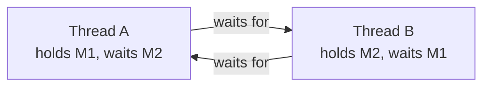

A **cycle in the wait-for graph** is necessary and sufficient for deadlock (among these waiters).

### Mutex-only deadlock (Birrell)

Self-deadlock: lock a mutex you already hold (unless the implementation allows recursive mutexes — SRC did not).

Classic AB-BA:

```text
A locks M1;  B locks M2;
A blocks on M2;  B blocks on M1.
```

**Prevention:** a **partial order** on mutexes. For every pair \(\{M_1, M_2\}\), every thread that holds both locks them in the **same** order.

### Condition-variable deadlock

Same idea with resources:

```text
A holds resource 1, waits on 2’s condition;
B holds resource 2, waits on 1’s condition.
```

Order the *resources*, not only the mutex objects.

### Nested monitors

`Wait` unlocks **only** the mutex passed to `Wait`. If `Get` holds mutex `a` and waits on `b`, mutex `a` stays locked. `Give` cannot acquire `a` to `Signal` — deadlock.

**Do not hold a high-level mutex while calling a lower layer that might block**, unless you know it cannot need that mutex.

### Lecture strategies

| Approach | Idea | Cost |
|---|---|---|
| One mega-lock | Get every lock up front | Simple, very restrictive |
| Lock ordering | Break cycles | Hard in large programs |
| Deadlock prevention | Static / runtime checks | Expensive |
| Detection + recovery | Find a cycle, rollback | Needs checkpoints |
| Ostrich algorithm | Ignore until it happens | Fine if deadlocks are rare |

Birrell: deadlock is a **comfortable** bug (the program stops with evidence). Wrong answers from races are worse — prefer deadlock over silent corruption when choosing lock granularity.

### Priority inversion (Birrell)

Low-priority \(C\) holds mutex \(M\); medium \(B\) preempts \(C\); high \(A\) blocks on \(M\); \(B\) runs forever. Fix belongs in the **scheduler** (priority inheritance). Raising priority around the lock is a programmer workaround.

---

## 14. Kernel-Level vs User-Level Threads

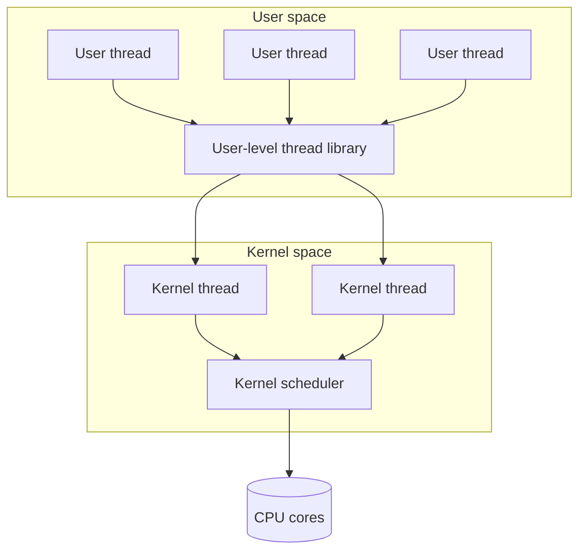

| | Kernel-level threads | User-level threads |
|---|---|---|
| Who manages them | OS scheduler | Library inside the process |
| Implies | Kernel is multi-threaded | Process is multi-threaded |
| Mapping | User thread must run on some kernel thread | Many user threads can share one kernel thread |
| Scope | **System scope** — OS sees all threads | **Process scope** — library sees only this process |

Birrell’s environment requirement: the OS must **not** stop the whole address space because one thread is in I/O or a page fault, and libraries must be **re-entrant**.

### Mapping models

| Model | Mapping | Strengths | Weaknesses |
|---|---|---|---|
| **1:1** | Each user thread ↔ one kernel thread | OS sees, schedules, and blocks **one** thread | Every op may be a syscall; OS limits; less portable |
| **Many:1** | Many user threads → one kernel thread | Portable; cheap user-level switch; no syscall for yield | OS cannot schedule threads of one process on many cores; **one blocking syscall blocks the process** |
| **Many:many** | \(M\) user threads ↔ \(N\) kernel threads | Mix of both; bound or unbound threads | Needs **coordination** between user and kernel thread managers |

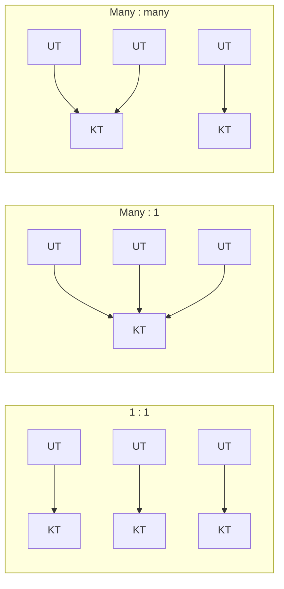

---

## 15. Multi-Threading Patterns

### 15.1 Boss–worker

| Role | Job |
|---|---|
| **Boss** | Accept work, assign it |
| **Worker** | Perform an entire task |

\[
\text{Throughput} \approx \frac{1}{\text{boss time per order}}
\]

Keep the boss **thin**. Throughput is limited by how fast the boss hands out work.

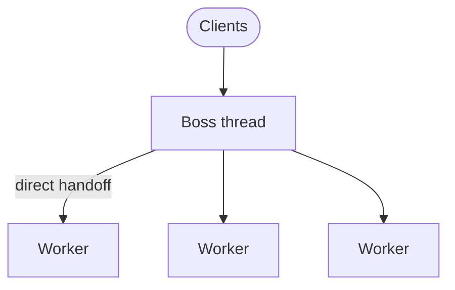

| Design | Upside | Downside |
|---|---|---|
| Boss picks a free worker and signals it | Workers need not sync with each other | Boss tracks who is free; boss time high |
| **Queue** between boss and workers | Boss only enqueues; any idle worker dequeues | Everyone syncs on the queue — still usually **less** boss time per order |

If the queue is **full**, the boss waits (back-pressure).

**How many workers?**

| Policy | Behavior |
|---|---|
| Static pool | Fixed size; predictable |
| Dynamic / on demand | Grow with load; workers available immediately; pool-management cost |

**Overall**

| | |
|---|---|
| **+** | Simple structure |
| **−** | Pool overhead; **locality** is weak — boss does not pin similar work to the same worker (cold caches) |

#### Variant: specialized workers

| Equal workers | Specialized workers |
|---|---|
| Any worker can take any job | Boss routes by type (e.g. disk vs CPU vs GPU) |
| Easy load balance | Better **locality** and **QoS** |
| | Boss does a bit more work; **load balancing is harder** |

Still usually a win: extra boss work < benefit of specialization.

---

### 15.2 Pipeline (lecture + Birrell)

| Idea | Detail |
|---|---|
| Stage | One subtask; one or more threads |
| Task | A **pipeline** of stages |
| Concurrency | Many tasks in flight, each in a different stage |
| Throughput | Limited by the **weakest** stage |
| Coupling | Usually **shared buffers** between stages (elasticity); or explicit handoff |


Birrell’s example: `PaintChar` → Rasterize thread → Painter thread, linked-list buffers, two conditions.

If one stage is slow, put a **thread pool** on that stage (not only one thread).

| | |
|---|---|
| **+** | Specialization, locality, near-linear speedup if stages are balanced |
| **−** | Balance is brittle; number of stages **statically** caps concurrency; buffer sync cost |

Pipeline also helps on **one CPU** if stages hit real delays (page faults, I/O, network).

---

### 15.3 Layered pattern

| Idea | Detail |
|---|---|
| Layer | A **group** of related tasks (coarser than a pipeline stage) |
| End-to-end work | Must pass **up and down** through the layers |

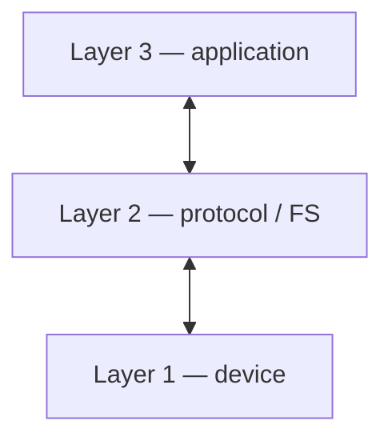

| | |
|---|---|
| **+** | Specialization; less fine-grained than a pipeline |
| **−** | Not a fit for every app; **cross-layer sync** is harder |

**Up-calls (Birrell / Clark):** for incoming packets, calling **up** the stack on the **same** thread avoids a context switch per layer. Fast network stacks do this. Cost: you now have both down-call and up-call interfaces, and holding a lower mutex while up-calling easily **violates lock order**.

---

### 15.4 Other Birrell techniques (beyond the lecture slides)

| Technique | Point |
|---|---|
| **Defer work** | `Fork` leftover work (or one housekeeper thread) to cut latency |
| **Work crews** | Fixed pool + request queue when you have an “embarrassment of parallelism” (don’t `Fork` per statement) |
| **Lazy fork** (proposal) | Don’t create the thread until a CPU is free |
| **Alerts** | Interrupt a long wait (`AlertWait` / `TestAlert`) for CANCEL; use sparingly — they divert control from another thread |
| **Version stamps** | Counter on cached data; detect stale use across threads / layers |
| **Too many ready threads** | Scheduler thrash and lock conflict; **blocked** threads are cheap (memory). SRC apps often had tens of blocked threads; the OS, hundreds |
| **Interfaces** | Library entry points must be **re-entrant**; synchronous APIs; no results in shared globals |

---

## 16. Putting a Concurrent Program Together (Birrell)

Aim for four properties:

| Property | Meaning for threads |
|---|---|
| Useful | APIs assume multi-threaded callers |
| Correct | If it finishes, the answer matches the spec — one mutex per piece of mutable data; always `WHILE` + `Wait` |
| Live | It **eventually** answers — no deadlock (debugger: list threads, stacks, waiters, mutex holders) |
| Efficient | Lock-conflict stats, concurrency level; **do not** trade correctness for speed |

Know your implementation’s costs: create, keep a blocked thread, context switch, uncontended `LOCK`. That tells you how small a job is worth a `Fork`.

---

## Quick takeaways

1. A **thread** is a sequential flow of control; many threads share one process address space and must **synchronize**.
2. Threads help **multi-CPU speedup**, **I/O overlap** (\(t_{\text{idle}} > 2 t_{\text{ctx}}\)), **UI / servers**, and **latency hiding** — Birrell’s reasons to use concurrency.
3. Lecture/`SRC` API: **`Fork` / `Join`**, **mutex** (critical sections, invariants), **condition variables** (`Wait` / `Signal` / `Broadcast`).
4. Always **`WHILE NOT predicate DO Wait`**. Signal **after** unlocking when possible. `Broadcast` vs `Signal` is mostly performance if the loop is present.
5. **Readers/writers** use a counter plus conditions so readers can share; watch **spurious wakes**, **starvation**, and **nested-monitor** deadlocks.
6. A **wait-for cycle** is deadlock; prevent with **lock/resource order**, or detect/recover, or use a coarse mega-lock.
7. **1:1 / many:1 / many:many** trade OS visibility against portability and blocking behavior.
8. Patterns: **boss–worker** (throughput \(= 1/\)boss time; queues help), **pipeline** (weakest stage; buffers), **layers** (plus Birrell **up-calls** on the receive path).
