# P2L3 — POSIX Threads (Pthreads)

## Overview

P2L2 introduced threads via Birrell’s abstract API (`Fork` / `Join`, mutexes, condition variables). This lesson maps those ideas onto **Pthreads** — the concrete, portable C API that became the de facto standard for multithreading on Unix-like systems.

| Term | Meaning |
|---|---|
| **POSIX** | *Portable Operating System Interface* — IEEE/ISO standards for OS APIs so programs can move across Unix systems |
| **Pthreads** | POSIX Threads — the POSIX thread + synchronization API (IEEE 1003.1c-1995, later folded into POSIX.1) |
| Goal of POSIX | Increase **interoperability**: same calls, same semantics, different kernels |

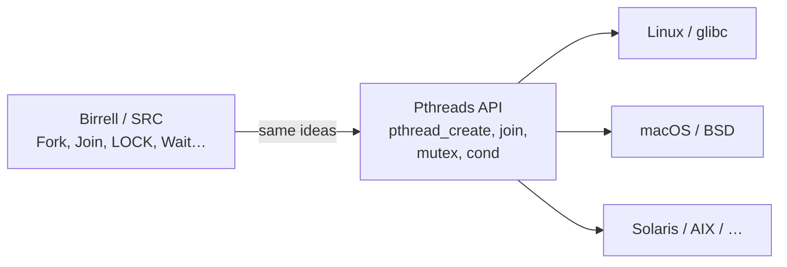

> **Interesting fact:** Before 1995, vendors shipped incompatible thread APIs (Solaris UI threads, DCE threads from an early POSIX draft, Mach C-threads, Win32 threads). Pthreads won on Unix because one `#include <pthread.h>` and one link flag replaced a zoo of proprietary libraries. Windows stayed on Win32; POSIX compatibility there usually means a shim (e.g. pthreads-win32 / mingw).

---

## 1. Birrell → Pthreads Cheat Sheet

Birrell’s Modula-2+ / Topaz primitives and Pthreads are deliberately parallel. Syntax differs; semantics match.

| Concept | Birrell (P2L2) | Pthreads |
|---|---|---|
| Thread type | `Thread` | `pthread_t` |
| Create | `Fork(proc, args)` | `pthread_create(...)` |
| Wait for result | `Join(thread)` | `pthread_join(thread, &status)` |
| Mutex type | `Mutex` | `pthread_mutex_t` |
| Lock / unlock | `LOCK mutex DO … END` (scoped) | `pthread_mutex_lock` / `unlock` (**explicit**) |
| Condition | `Condition` | `pthread_cond_t` |
| Wait / Signal / Broadcast | `Wait`, `Signal`, `Broadcast` | `pthread_cond_wait`, `_signal`, `_broadcast` |
| Detached threads | Not in Birrell | `pthread_detach` / `PTHREAD_CREATE_DETACHED` |

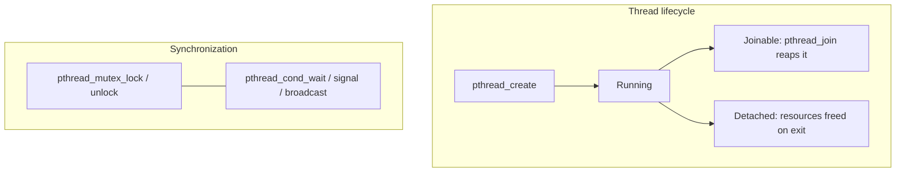

---

## 2. Thread Creation

### Types and core calls

```c
pthread_t aThread;   /* opaque thread ID / handle */

int pthread_create(pthread_t *thread,
                   const pthread_attr_t *attr,
                   void *(*start_routine)(void *),
                   void *arg);

int pthread_join(pthread_t thread, void **status);
```

| Argument | Role |
|---|---|
| `thread` | Out-parameter: filled with the new thread’s ID |
| `attr` | Optional attributes (`NULL` = defaults) |
| `start_routine` | Function the new thread runs (Birrell’s `proc`) |
| `arg` | Single `void *` argument (Birrell’s `args`) |
| Return value | `0` on success; nonzero error code on failure |

`pthread_join` blocks until the target finishes and can collect the pointer returned by `start_routine` (or passed to `pthread_exit`).

> **Interesting fact:** `pthread_t` is intentionally **opaque**. On Linux it is often a `unsigned long`; on some BSDs it is a pointer to a struct. Never assume you can print it as an `int` portably — use whatever the platform documents (or don’t rely on the numeric value at all).

### Thread attributes (`pthread_attr_t`)

Attributes let you control stack size, scheduling policy/priority, contention **scope**, inheritance, and joinable vs detached — without baking those choices into every `pthread_create` call site.

```c
int pthread_attr_init(pthread_attr_t *attr);
int pthread_attr_destroy(pthread_attr_t *attr);
/* then pthread_attr_set*/get* for each field */
```

| Attribute (examples) | Typical knobs |
|---|---|
| Stack size | `pthread_attr_setstacksize` |
| Detach state | `PTHREAD_CREATE_JOINABLE` (default) vs `PTHREAD_CREATE_DETACHED` |
| Scope | `PTHREAD_SCOPE_SYSTEM` vs `PTHREAD_SCOPE_PROCESS` |
| Inherit sched | Inherit caller’s scheduling params or set explicitly |

Pass `NULL` for `attr` → library defaults (joinable, implementation-defined stack, etc.).

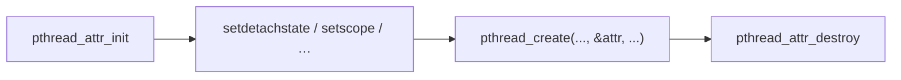

---

## 3. Joinable vs Detached Threads

Birrell assumed joinable children. Pthreads adds **detached** threads — a practical extension for servers and fire-and-forget workers.

| | Joinable (default) | Detached |
|---|---|---|
| Who reaps? | Another thread must `pthread_join` | System reaps automatically on exit |
| Can you join? | Yes | No (`ESRCH` / undefined if you try) |
| If parent exits early? | Child may become a **zombie** until joined | Child keeps running; no join required |
| Typical use | Need a return value or strict lifetime | Daemons, request handlers, background work |

Two ways to detach:

```c
pthread_detach(tid);   /* after create, or from inside the thread */

pthread_attr_setdetachstate(&attr, PTHREAD_CREATE_DETACHED);
pthread_create(&tid, &attr, start, arg);
```

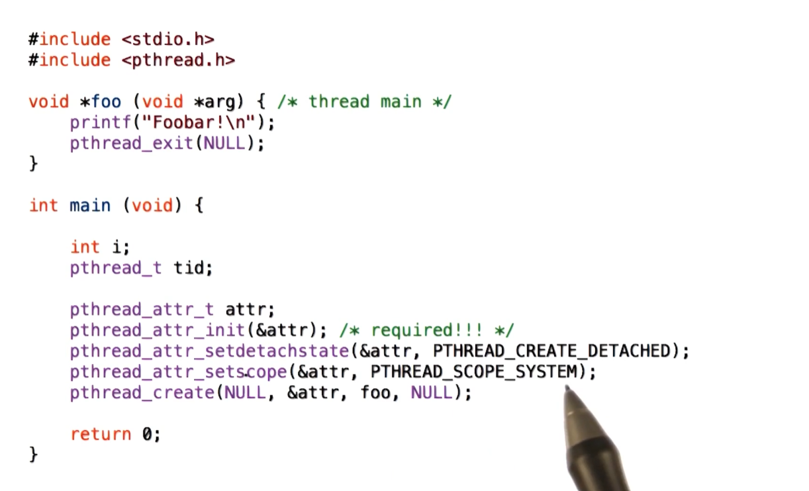

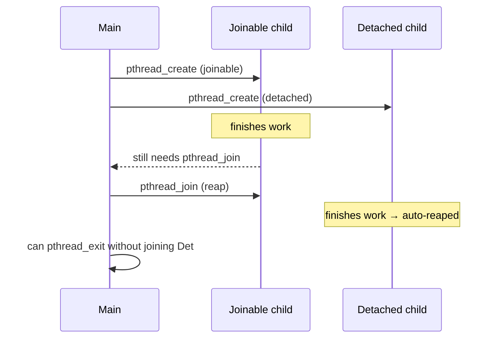

> **Interesting fact:** “Zombie thread” is the same idea as a Unix zombie process: the thread has exited, but a small control record stays around so `pthread_join` can still return its status. Detach = “I will never join — free that record immediately when the thread dies.”

---

## 4. Compiling Pthreads

1. `#include <pthread.h>`
2. Link with threads support:
   - `-pthread` — preferred on GCC/Clang: links the library **and** turns on thread-aware defines / codegen
   - `-lpthread` — links the library only (older style; can miss macros on some platforms)
3. **Always check return codes** on `pthread_create`, `pthread_mutex_init`, `pthread_cond_wait`, etc. Failures are silent if you ignore them — races then look “random.”

```bash
gcc -Wall -O2 -pthread demo.c -o demo
```

> **Why `-pthread` and not only `-lpthread`?** On some toolchains, compiling *without* `-pthread` omits `_REENTRANT` / similar defines, so libc may use non-thread-safe variants of errno-adjacent or stdio internals. Linking alone can leave you with a binary that “works until it doesn’t.”

---

## 5. Creation Examples and Race Quizes

### Example A — four joinable “hello” threads

```c
#include <stdio.h>
#include <pthread.h>

void *hello(void *arg) {
    printf("Hello Thread\n");
    return NULL;
}

int main(void) {
    pthread_t tid[4];
    int i;

    for (i = 0; i < 4; i++)
        pthread_create(&tid[i], NULL, hello, NULL);  /* default attrs */

    for (i = 0; i < 4; i++)
        pthread_join(tid[i], NULL);

    return 0;
}
```

**Output:** `Hello Thread` printed **four times** (order of the four lines is not guaranteed across weird schedulers, but you will see four lines).

### Example B — detached + attributes

```c
#include <stdio.h>
#include <pthread.h>

void *foo(void *arg) {
    printf("Foobar!\n");
    pthread_exit(NULL);
}

int main(void) {
    pthread_t tid;
    pthread_attr_t attr;

    pthread_attr_init(&attr);
    pthread_attr_setdetachstate(&attr, PTHREAD_CREATE_DETACHED);
    pthread_attr_setscope(&attr, PTHREAD_SCOPE_SYSTEM);
    pthread_create(&tid, &attr, foo, NULL);
    pthread_attr_destroy(&attr);

    /* Do not join a detached thread. Main may need to wait somehow
       (sleep, pthread_exit from main, etc.) or the process can exit
       before foo runs. */
    pthread_exit(NULL);  /* exit main thread; process lives until foo done */
}
```

`PTHREAD_SCOPE_SYSTEM` asks the implementation to schedule the thread against **all** runnable threads in the system (1:1 with a kernel schedulable entity on modern Linux). `PTHREAD_SCOPE_PROCESS` is for contention within the process (more relevant to M:N user-level models; often ignored or unsupported).

### Example C — the classic “pass `&i`” race

```c
#define NUM_THREADS 4

void *threadFunc(void *pArg) {
    int *p = (int *)pArg;
    int myNum = *p;                 /* private copies after this line */
    printf("Thread number %d\n", myNum);
    return 0;
}

int main(void) {
    int i;
    pthread_t tid[NUM_THREADS];

    for (i = 0; i < NUM_THREADS; i++)
        pthread_create(&tid[i], NULL, threadFunc, &i);  /* BUG: shared i */

    for (i = 0; i < NUM_THREADS; i++)
        pthread_join(tid[i], NULL);
    return 0;
}
```

**What can happen?**

| Observation | Possible? | Why |
|---|---|---|
| Prints `0 1 2 3` in some order | Yes | Lucky timing; each read saw the intended `i` |
| Prints e.g. `0 2 1 3` | Yes | Scheduler reorders who runs `printf` |
| Missing a number / duplicates (e.g. two `2`s, no `1`) | **Yes** | **Data race** on `i` |

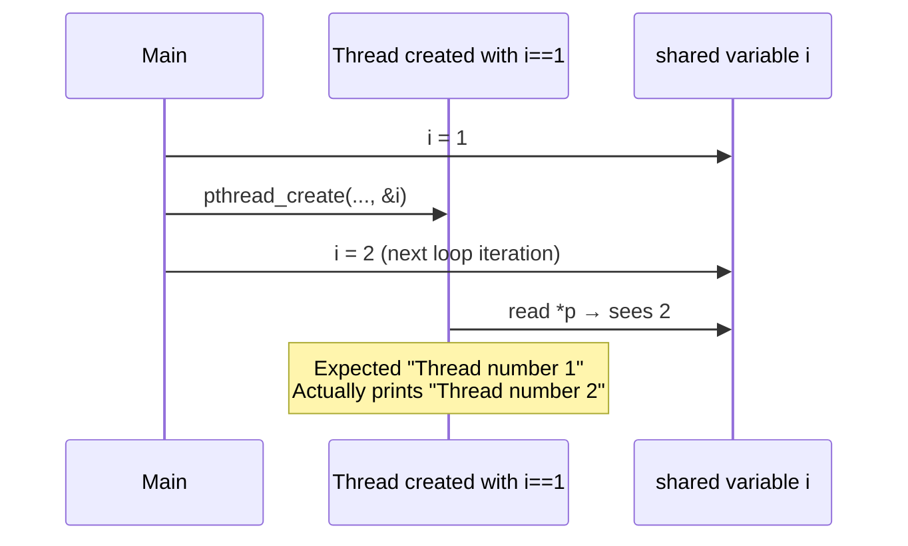

Private locals `p` and `myNum` do **not** help if the *source* of the value is a shared, mutating `i`. Both threads can observe the same later value.

### Fixed version — private slot per thread

```c
int tNum[NUM_THREADS];

for (i = 0; i < NUM_THREADS; i++) {
    tNum[i] = i;   /* stable storage for this thread’s argument */
    pthread_create(&tid[i], NULL, threadFunc, &tNum[i]);
}
```

Now each child gets a distinct address that main will not overwrite. You still may see `0..3` in **any order**, but you will not lose or duplicate IDs because of the race on `i`.

> **Interesting fact:** Casting `i` itself to `void *` (`(void *)(intptr_t)i`) and casting back inside the thread is a common classroom trick that also avoids the race — you pass the **value**, not a pointer to a moving variable. It is only safe for integer-sized values and is frowned on in strict portable code, but it makes the race lesson vivid.

---

## 6. Pthread Mutexes

Mutexes enforce **mutual exclusion**: at most one thread holds the lock, so only one thread at a time runs the critical section that touches a given piece of shared state.

### API

```c
pthread_mutex_t aMutex;

int pthread_mutex_init(pthread_mutex_t *mutex,
                       const pthread_mutexattr_t *attr);
int pthread_mutex_destroy(pthread_mutex_t *mutex);

int pthread_mutex_lock(pthread_mutex_t *mutex);     /* may block */
int pthread_mutex_unlock(pthread_mutex_t *mutex);
int pthread_mutex_trylock(pthread_mutex_t *mutex);  /* never blocks */
```

Static initializer (no explicit `init` needed for process-private default mutexes):

```c
pthread_mutex_t m = PTHREAD_MUTEX_INITIALIZER;
```

Birrell’s scoped `LOCK m DO … END` becomes **explicit** lock/unlock in C:

```c
pthread_mutex_lock(&m);
/* critical section — shared list insert, etc. */
pthread_mutex_unlock(&m);
```

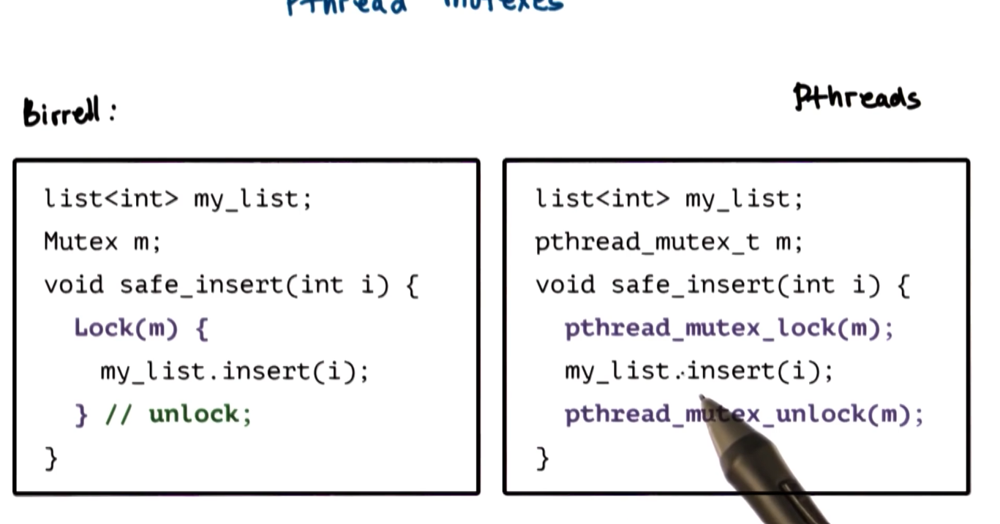

| Call | Behavior |
|---|---|
| `lock` | Block until the mutex is free, then acquire it |
| `unlock` | Release; wake one waiter if any |
| `trylock` | If free → lock and return success; if held → **return immediately** with an error (caller can do other work) |

Mutex **attributes** can mark a mutex as process-shared (`PTHREAD_PROCESS_SHARED`) so threads in different processes (with the mutex in shared memory) can synchronize. Default is process-private.

### Mutex safety tips (lecture)

1. **One mutex ↔ one shared data set.** Every access path to that data goes through the same mutex.
2. **Mutex must be visible to all participants** — typically file-scope / globals or heap objects shared by design. A stack-local mutex in `main` that children never see is useless.
3. **Global lock order.** If threads acquire multiple mutexes, every thread takes them in the **same** order → avoids classic mutex-only deadlock.
4. **Always unlock the correct mutex.** Compilers will not catch a missing `unlock` the way Birrell’s scoped `LOCK` did.

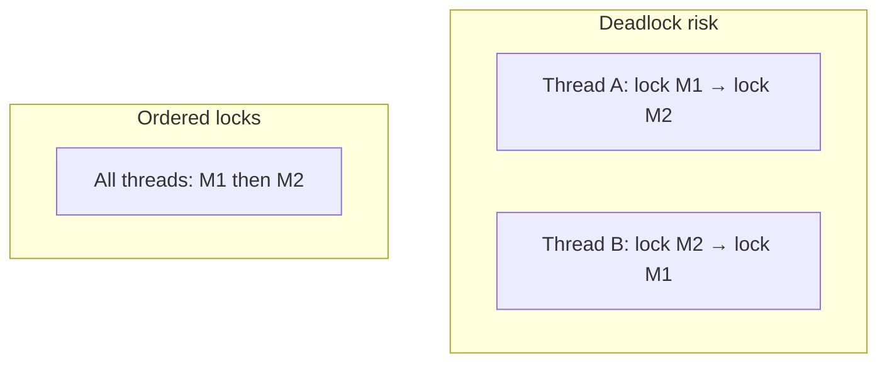

> **Interesting fact:** POSIX defines mutex **types** — normal, error-checking, recursive. Recursive mutexes allow the *same* thread to `lock` again without deadlocking itself; they hide design bugs and add cost. Prefer non-recursive mutexes unless you have a measured reason (many coding standards ban recursive mutexes).

---

## 7. Pthread Condition Variables

Condition variables let a thread **wait for a predicate** on shared state (buffer not empty, not full, …) and be **notified** when another thread may have made that predicate true.

```c
pthread_cond_t aCond;

int pthread_cond_wait(pthread_cond_t *cond, pthread_mutex_t *mutex);
int pthread_cond_signal(pthread_cond_t *cond);      /* wake ≥ one */
int pthread_cond_broadcast(pthread_cond_t *cond);   /* wake all */

int pthread_cond_init(pthread_cond_t *cond, const pthread_condattr_t *attr);
int pthread_cond_destroy(pthread_cond_t *cond);
```

Semantics match Birrell:

1. Caller must hold `mutex`.
2. `wait` **atomically** releases `mutex` and blocks on `cond`.
3. On wake, `wait` **re-acquires** `mutex` before returning.
4. Always re-check the predicate in a **`while` loop** (Mesa / POSIX semantics → spurious or stolen wakeups).

```c
pthread_mutex_lock(&m);
while (!predicate)
    pthread_cond_wait(&cv, &m);
/* predicate true, still holding m */
pthread_mutex_unlock(&m);
```

### Condition-variable safety tips

| Tip | Why |
|---|---|
| Never forget to signal/broadcast when the predicate changes | Waiters sleep forever → livelock that looks like a hang |
| When unsure, prefer `broadcast` then refine to `signal` | Correctness first; `signal` is an optimization when exactly one waiter can proceed |
| You do **not** need to hold the mutex to call `signal` / `broadcast` | Moving notify **after** `unlock` often reduces unnecessary contention / thundering herds |
| Pair each CV with the mutex that protects its predicate | Waiting without the right lock is undefined / racy |

> **Interesting fact:** `pthread_cond_signal` is allowed to wake **more than one** waiter on some implementations (“spurious extra wakes”), and waiters can also wake for no reason. That is why textbooks hammer the `while (!pred) wait` pattern — it is not paranoia; it is the POSIX contract.

---

## 8. Producer–Consumer in Pthreads

Classic bounded buffer: producers insert, consumers remove, size `BUF_SIZE`. Two condition variables separate the two reasons to wait.

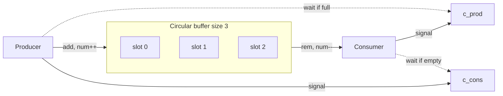

### Shared state and sync objects

```c
#define BUF_SIZE 3

int buffer[BUF_SIZE];
int add = 0;   /* next write index */
int rem = 0;   /* next read index */
int num = 0;   /* how many items currently stored */

pthread_mutex_t m = PTHREAD_MUTEX_INITIALIZER;
pthread_cond_t c_cons = PTHREAD_COND_INITIALIZER;  /* consumers wait here */
pthread_cond_t c_prod = PTHREAD_COND_INITIALIZER;  /* producers wait here */
```

Walk-through of indices (lecture):

| Action | `num` | `add` | `rem` | Buffer idea |
|---|---|---|---|---|
| Start | 0 | 0 | 0 | empty |
| Produce `x` | 1 | 1 | 0 | `[x, ?, ?]` |
| Produce `y` | 2 | 2 | 0 | `[x, y, ?]` |
| Consume | 1 | 2 | 1 | `[–, y, ?]` next remove is `y` |

### Main

```c
pthread_t tid1, tid2;

if (pthread_create(&tid1, NULL, producer, NULL) != 0) {
    fprintf(stderr, "Unable to create producer thread\n");
    exit(1);
}
if (pthread_create(&tid2, NULL, consumer, NULL) != 0) {
    fprintf(stderr, "Unable to create consumer thread\n");
    exit(1);
}

pthread_join(tid1, NULL);
pthread_join(tid2, NULL);
printf("Parent quitting\n");
```

### Producer (insert up to 20 items)

```c
void *producer(void *param) {
    int i;
    for (i = 1; i <= 20; i++) {
        pthread_mutex_lock(&m);
            if (num > BUF_SIZE)
                exit(1);                 /* sanity: overflow */
            while (num == BUF_SIZE)      /* full → wait */
                pthread_cond_wait(&c_prod, &m);

            buffer[add] = i;
            add = (add + 1) % BUF_SIZE;
            num++;
        pthread_mutex_unlock(&m);

        pthread_cond_signal(&c_cons);    /* one new item → one consumer */
        printf("producer: inserted %d\n", i);
        fflush(stdout);
    }
    printf("producer quitting\n");
    fflush(stdout);
    return 0;
}
```

### Consumer (runs forever in the lecture demo)

```c
void *consumer(void *param) {
    int i;
    while (1) {
        pthread_mutex_lock(&m);
            if (num < 0)
                exit(1);                 /* sanity: underflow */
            while (num == 0)             /* empty → wait */
                pthread_cond_wait(&c_cons, &m);

            i = buffer[rem];
            rem = (rem + 1) % BUF_SIZE;
            num--;
        pthread_mutex_unlock(&m);

        pthread_cond_signal(&c_prod);    /* one free slot → one producer */
        printf("Consume value %d\n", i);
        fflush(stdout);
    }
    return 0;
}
```

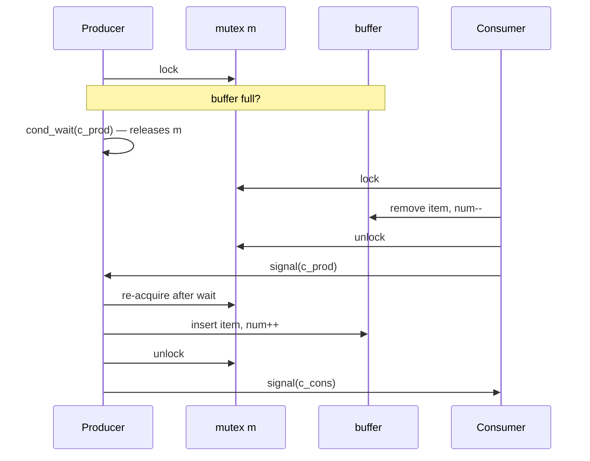

**Design notes from the lecture**

- **`while` not `if`** around both waits — required for correctness.
- Signal **after** unlock when the signal does not depend on still holding shared state under the lock (consumer does this); reduces the chance a woken thread immediately blocks again on the mutex.
- One item produced/consumed → `signal` is enough; `broadcast` would wake many threads that then contend and mostly sleep again.
- Consumer never exits in this demo → `pthread_join` on the consumer would hang; the example is for illustrating sync, not a graceful shutdown protocol.

> **Interesting fact:** The bounded-buffer / producer–consumer problem is from the earliest days of concurrent programming (Dijkstra’s work on semaphores in the 1960s). Pthreads just gives you mutex + condition variables as the modern packaging; the invariants (`0 ≤ num ≤ BUF_SIZE`, circular indices) are unchanged since the textbook era.

---

## 9. Full Producer–Consumer Listing

```c
#include <stdio.h>
#include <stdlib.h>
#include <pthread.h>

#define BUF_SIZE 3

int buffer[BUF_SIZE];
int add = 0;
int rem = 0;
int num = 0;

pthread_mutex_t m = PTHREAD_MUTEX_INITIALIZER;
pthread_cond_t c_cons = PTHREAD_COND_INITIALIZER;
pthread_cond_t c_prod = PTHREAD_COND_INITIALIZER;

void *producer(void *param);
void *consumer(void *param);

int main(int argc, char *argv[]) {
    pthread_t tid1, tid2;

    if (pthread_create(&tid1, NULL, producer, NULL) != 0) {
        fprintf(stderr, "Unable to create producer thread\n");
        exit(1);
    }
    if (pthread_create(&tid2, NULL, consumer, NULL) != 0) {
        fprintf(stderr, "Unable to create consumer thread\n");
        exit(1);
    }

    pthread_join(tid1, NULL);
    pthread_join(tid2, NULL);
    printf("Parent quitting\n");
    return 0;
}

void *producer(void *param) {
    int i;
    for (i = 1; i <= 20; i++) {
        pthread_mutex_lock(&m);
        if (num > BUF_SIZE)
            exit(1);
        while (num == BUF_SIZE)
            pthread_cond_wait(&c_prod, &m);

        buffer[add] = i;
        add = (add + 1) % BUF_SIZE;
        num++;
        pthread_mutex_unlock(&m);

        pthread_cond_signal(&c_cons);
        printf("producer: inserted %d\n", i);
        fflush(stdout);
    }
    printf("producer quitting\n");
    fflush(stdout);
    return 0;
}

void *consumer(void *param) {
    int i;
    while (1) {
        pthread_mutex_lock(&m);
        if (num < 0)
            exit(1);
        while (num == 0)
            pthread_cond_wait(&c_cons, &m);

        i = buffer[rem];
        rem = (rem + 1) % BUF_SIZE;
        num--;
        pthread_mutex_unlock(&m);

        pthread_cond_signal(&c_prod);
        printf("Consume value %d\n", i);
        fflush(stdout);
    }
    return 0;
}
```

---

## 10. Lesson Takeaways

1. **Pthreads = portable Birrell** for C on Unix: create/join, mutexes, condition variables.
2. **`pthread_attr_t`** configures stack, scheduling, scope, and **detach state**; `NULL` means defaults.
3. **Detached threads** are the main Pthreads extension beyond Birrell — no join, no zombie bookkeeping.
4. Compile with **`-pthread`**, include **`<pthread.h>`**, check return values.
5. Passing **`&i` from a creating loop** is a classic race; give each thread **stable private storage** (or pass by value carefully).
6. Mutexes need **explicit** unlock and a **global lock order**; condition waits always sit in a **`while`** loop.
7. Producer–consumer: one mutex for the buffer, **two** condition variables (full vs empty), circular indices, signal the *other* side after you change `num`.

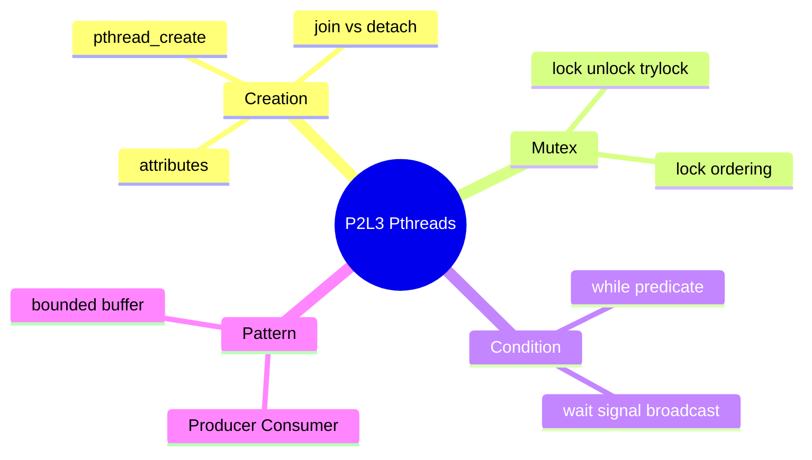
