# P2L4 — Kernel Threads, Interrupts, and Signals

## Overview

P2L2/P2L3 covered *using* threads. This lesson looks underneath: how **kernel-level threads (KLTs)** and **user-level threads (ULTs)** are structured, how they interact, and how **interrupts** / **signals** fit into a multithreaded OS.

Primary reference: J. R. Eykholt et al., [*Beyond Multiprocessing … Multithreading the SunOS Kernel*](https://s3.amazonaws.com/content.udacity-data.com/courses/ud923/references/ud923-eykholt-paper.pdf) (USENIX Summer 1992) — the SunOS 5.0 / Solaris 2.0 kernel redesign. Companion user-library paper: Stein & Shah, *Implementing Lightweight Threads*.

| Topic | What you should take away |
|---|---|
| Kernel vs user threads | Who schedules, who syncs, what each layer sees |
| Split state (hard / light) | Why one big PCB does not scale |
| SunOS / Solaris model | Kernel threads → LWPs → ULTs |
| Interrupts as threads | Why raising IPL on every mutex loses; adaptive + interrupt threads win |
| Signals | Per-thread masks; coordinating UL vs KL visibility |
| Linux `task_struct` / NPTL | Modern 1:1 baseline |

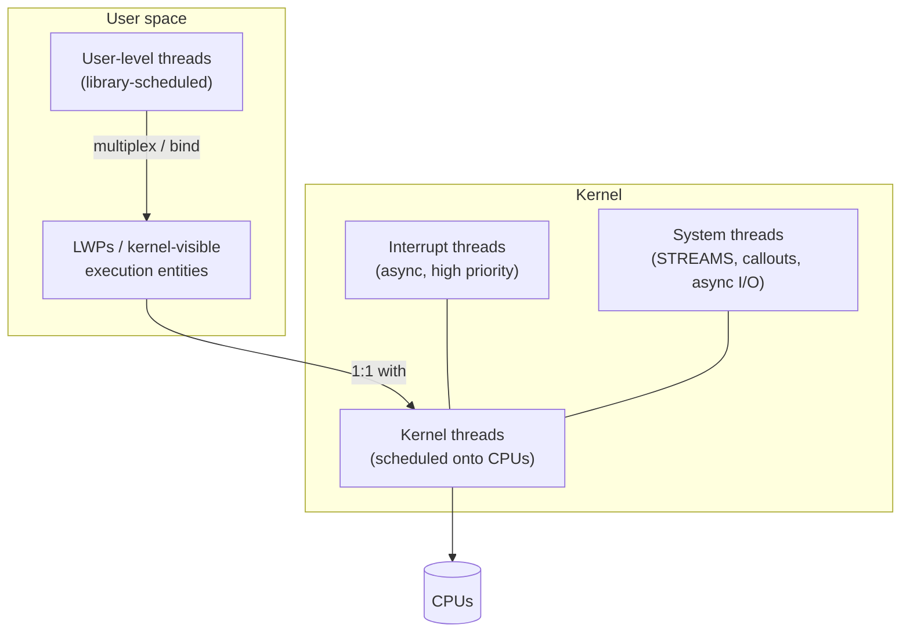

> **Interesting fact:** SunOS 5.0 made the kernel itself look like a multithreaded app: same mutex / CV / RW / semaphore ideas inside the kernel as in the user library, with **priority inheritance** so real-time threads are not stuck behind lock holders.

---

## 1. Kernel-Level vs User-Level Threads

| | Kernel-level threads (KLTs) | User-level threads (ULTs) |
|---|---|---|
| Who creates / destroys | OS / kernel | User thread library |
| Who schedules | Kernel scheduler | Library scheduler (onto KLTs/LWPs) |
| Who provides sync | Kernel primitives | Library primitives (may trap into kernel) |
| Visibility | Kernel sees every KLT | Kernel may not see individual ULTs (M:N) |
| Cost of switch | Trap / privileged path (heavier) | Often pure user-mode (cheap) |
| Blocking I/O | Blocks that KLT; other KLTs can run | If only KLT blocks, whole process may stall unless coordinated |
| Flexibility | One model for all processes | Different processes can use different libraries |

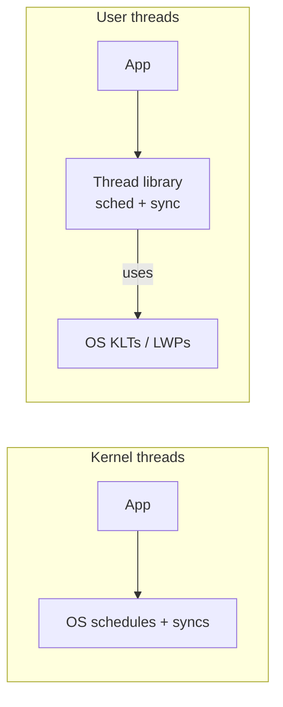

**Mapping models**

| Model | Meaning | Tradeoff |
|---|---|---|
| **1:1** | Each ULT ↔ one KLT/LWP | Simple visibility; more kernel resources |
| **M:N** | Many ULTs multiplexed on fewer KLTs | Cheap switches; coordination hard |
| **Bound / pinned** | ULT permanently tied to one KLT | Predictable; loses multiplexing benefit |

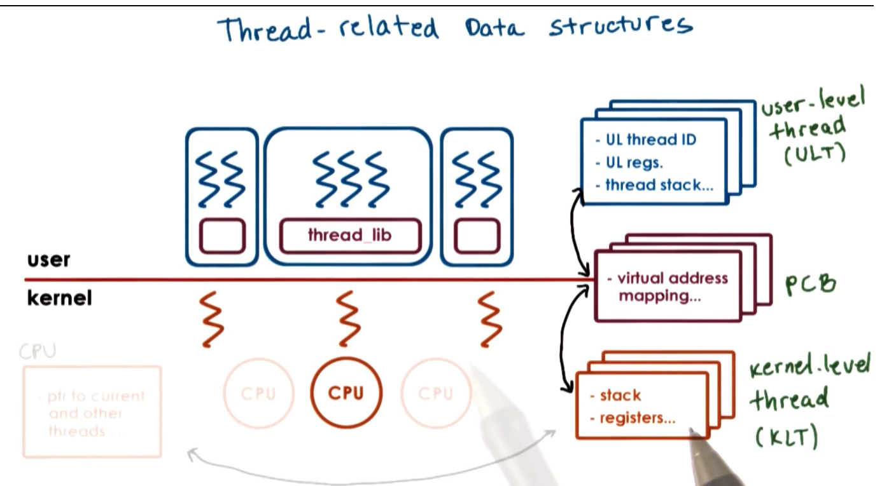

---

## 2. Why Split Process State? (Hard vs Light)

### The old design: one fat PCB

Traditional kernels stuffed almost everything into a single **process control block** (plus a swappable `user` area): registers, address space, credentials, open files, signal handlers, stack, etc.

| Property of a single PCB | Consequence |
|---|---|
| Large contiguous structure | Cache / TLB pressure; hard to share pieces |
| Private per process | Cannot represent “many threads, one address space” cleanly |
| Saved/restored on every context switch | Extra work even when most fields do not change |
| Updated on any state change | Contention and overhead under concurrency |

### The SunOS redesign: multiple smaller structures

Eykholt et al. split state by *lifetime and sharing*:

| Structure | Holds | Swappable? | Notes |
|---|---|---|---|
| **`proc`** | Process-wide: address space, credentials, signal *handlers*, list of threads | Mostly resident; vestigial `user` area shrunk | Shared by all threads in the process |
| **LWP** | User-visible execution context: user registers (PCB), syscall args, signal *mask*, rusage, profiling | Yes (with kernel stack) | One LWP ↔ one kernel thread for user work |
| **Kernel thread** | Kernel registers, sched class, dispatch links, stack ptr, pointers to LWP/proc/CPU | No | Fundamental schedulable entity |
| **`cpu`** | Current thread, idle thread, dispatch + interrupt info | N/A | Per-processor |

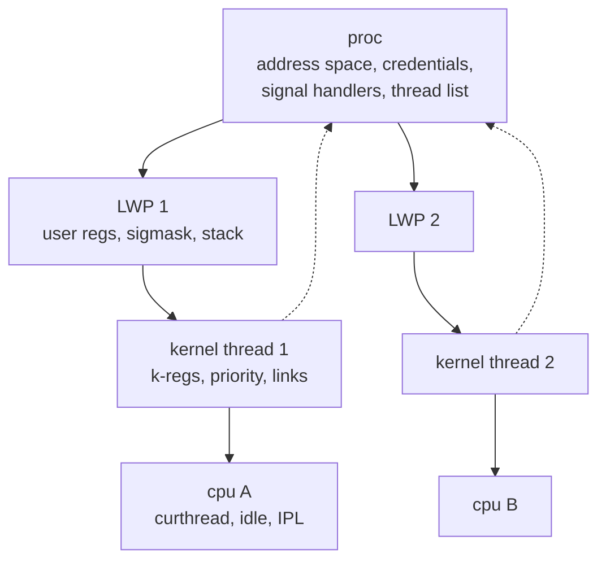

**Hard vs light process state (course phrasing)**

| Kind | Roughly maps to | Changes when… |
|---|---|---|
| **Heavy / hard process state** | Address space, open files, credentials, handler table (`proc`) | Process-wide events; shared by all threads |
| **Light process state** | Registers, SP, signal mask, priority, TLS (`LWP` + thread) | Context switch of that execution context |

**Why multiple structures win**

| Goal | How split state helps |
|---|---|
| Scalability | Smaller hot structures; less false sharing |
| Lower overhead | Context switch saves/restores only what that thread needs |
| Flexibility | User library updates ULT state without touching kernel `proc` |
| Sharing | Many threads → one `mm` / files table |
| Concurrency | Independent threads can enter the kernel / take page faults together |

On SPARC SunOS, `%g7` pointed at `curthread` so field access was a single instruction.

---

## 3. Solaris / SunOS Thread Architecture

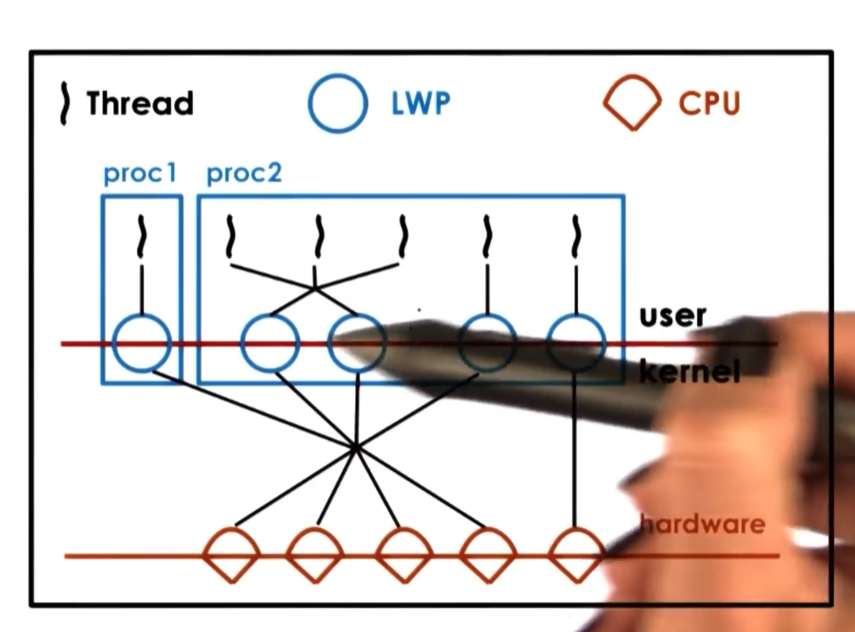

| Layer | Role |
|---|---|
| **User threads** | Library-scheduled; can be unbound (multiplexed) or bound to an LWP |
| **LWPs** | Kernel-supported “lightweight processes”; each has a kernel thread |
| **Kernel threads** | Scheduled onto CPUs; also used for interrupts and pure kernel work |
| **System threads** | No LWP; async writes, STREAMS, callouts — scheduled in *system* class |

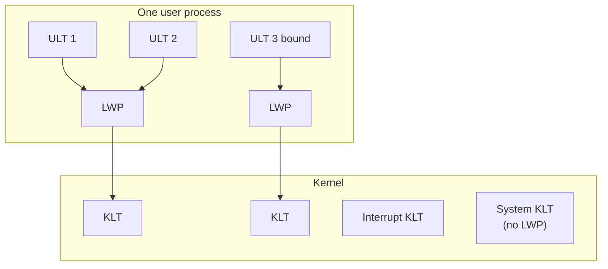

> Not all kernel threads have an LWP. Interrupt and system threads are kernel-only.

### User-level thread structures (library side)

Typical creation path (Solaris-style lightweight threads, related to POSIX ideas):

| Step | Detail |
|---|---|
| Create | Library returns a `thread_id` (`tid`) |
| Lookup | `tid` → index into a table of pointers |
| Per-thread data | Registers, signal mask, priority, stack pointer, TLS, stack |

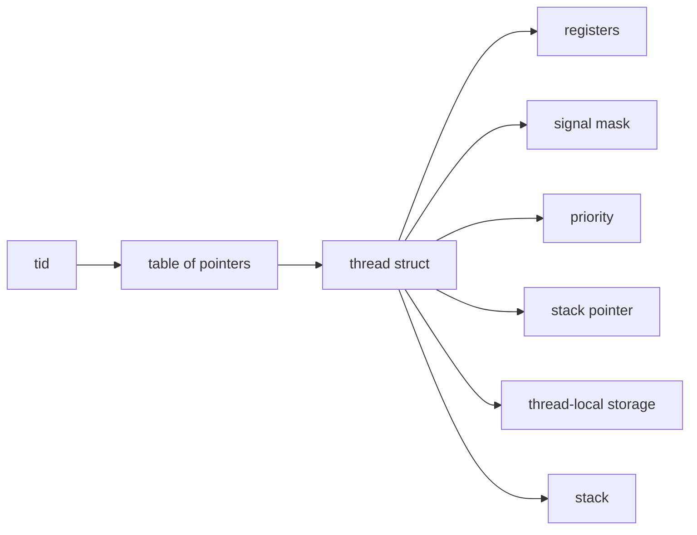

| Problem | Solution |
|---|---|
| Stack growth can smash adjacent memory | **Red zone**: guard virtual pages the thread must not write (`seg_kp` in SunOS) |

---

## 4. Kernel ↔ User Thread Management

### Visibility gap

| Layer sees | Does **not** automatically see |
|---|---|
| **UL library:** ULTs, available KLTs/LWPs | Exact kernel blocking reasons, CPU placement of other processes |
| **Kernel:** KLTs, CPUs, kernel scheduler | Which ULT is current (unless 1:1 / bound), UL lock ownership |

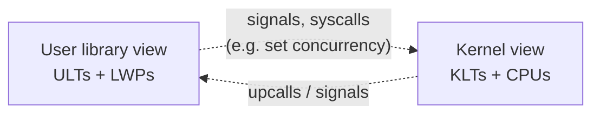

Coordination uses **system calls** and **special signals/upcalls** so the library and kernel can request more concurrency, notice blocking, and shrink excess KLTs.

### Classic blocking problem (M:N)

| Step | What happens |
|---|---|
| 1 | Process starts with a default number of KLTs |
| 2 | App may request more via something like `set concurrency` |
| 3 | Two ULTs (bound/running on KLTs) block in I/O → those KLTs block |
| 4 | Other runnable ULTs may sit idle if no free KLT remains |
| 5 | If the kernel notified the library before sleep, library could request another KLT |
| 6 | When I/O completes, excess KLTs can be reaped |

**Pinning / bound threads:** a ULT locked to a KLT. In a pure **1:1** model, everything is effectively bound — visibility is better, multiplexing cost moves into the kernel.

### When the process enters the UL scheduler

| Trigger | Example |
|---|---|
| Explicit yield | Thread yields |
| Library timer | Time slice inside the process |
| Sync ops | Lock / unlock / wait in the library |
| Wakeups | Blocked ULT becomes runnable |
| Signals | Timer or kernel signal → run library code |

### Scheduler activation problem on multiple CPUs

| Situation | Why it hurts |
|---|---|
| T2 holds a mutex on CPU1; T3 waits (higher priority); T1 runs on CPU2 | When T2 unlocks, T3 should run *now* |
| T1’s registers live on another CPU | Library on CPU1 cannot rewrite CPU2’s registers |
| Fix | Signal / IPI so CPU2 runs library code locally and preempts T1 for T3 |

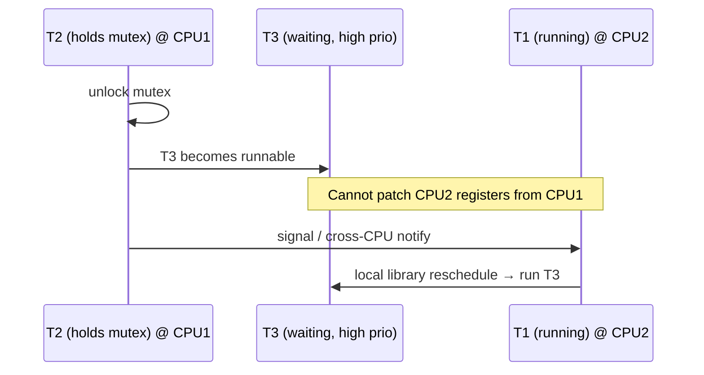

### Adaptive mutexes (user and kernel)

| Critical-section length | Strategy |
|---|---|
| Short, owner still running on another CPU | **Spin** (adaptive) |
| Owner not running / wait may be long | **Sleep** on mutex queue |

Adaptive mutexes matter mainly on **multiprocessors**. On a uniprocessor, spinning on a non-running owner is useless → sleep immediately (Eykholt).

### Destroying / recycling threads

| Approach | Detail |
|---|---|
| Avoid eager free | Exiting threads go on a **death row** |
| Reaper | Periodic thread destroys truly dead ones |
| Reuse | Structures / stacks recycled for new creates |

---

## 5. Interrupts vs Signals

| | Interrupts | Signals |
|---|---|---|
| Source | External hardware (devices, timers, other CPUs) | CPU exception or software (`kill`, etc.) |
| Defined by | Platform / interrupt controller | OS signal numbers and policy |
| Timing | Asynchronous | Async *or* sync (fault in response to an instruction) |
| Delivery | Vector → interrupt handler | Signal number → default action or handler |

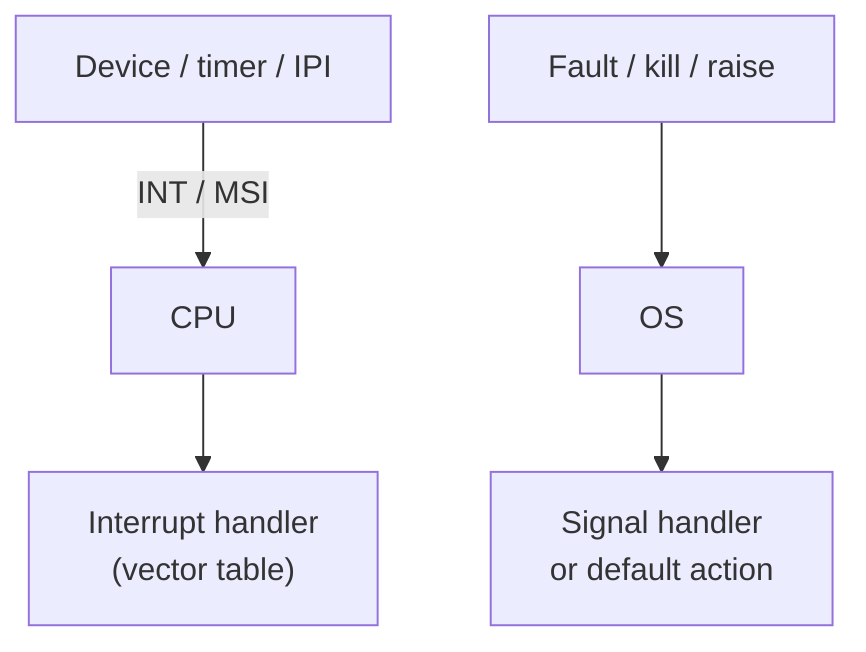

### Signal handlers and default actions

| Mechanism | Role |
|---|---|
| Defaults | Terminate, ignore, core dump, stop, continue |
| Install handler | `signal()` / `sigaction()` |
| Uncatchable | Some signals cannot be caught (e.g. `SIGKILL`) |

| Sync-style examples | Cause |
|---|---|
| `SIGSEGV` | Bad memory access |
| `SIGFPE` | Divide by zero / FP error |

### Why mask interrupts / signals?

| Danger | Scenario |
|---|---|
| Shared stack pointer | Handler runs on interrupted thread’s stack (same SP) |
| Lock reentry | Thread holds mutex; handler tries same mutex → **deadlock** |
| Mitigations | Keep handlers tiny (no locks); or **mask** so handler cannot run in unsafe windows |

| Mask type | Scope | Effect when disabled |
|---|---|---|
| **Interrupt mask** | Per **CPU** | Hardware will not deliver those IRQs to that CPU |
| **Signal mask** | Per **execution context** (ULT on KLT) | Kernel will not interrupt that thread for masked signals |

### Multicore interrupt steering

| Policy | Benefit |
|---|---|
| IRQ can target any enabled CPU | Flexibility |
| Pin IRQ to one core | Other cores avoid handler overhead / cache perturbation |

---

## 6. Interrupts as Threads (Eykholt / SunOS 5.0)

### The old cost of “block interrupts around mutexes”

| Drawback | Why |
|---|---|
| Raise/lower IPL on every mutex | Expensive, especially with external interrupt controllers |
| Modular kernel interdependencies | Many locks must run at high IPL “just in case” an IRQ needs them |
| Constrained handlers | IRQ code cannot sleep or use normal sync |

**SunOS idea:** treat most interrupts as **asynchronously created, high-priority kernel threads** that use normal mutexes/CVs. If the lock is busy, the interrupt thread **blocks** and the pinned thread continues so the critical section can finish.

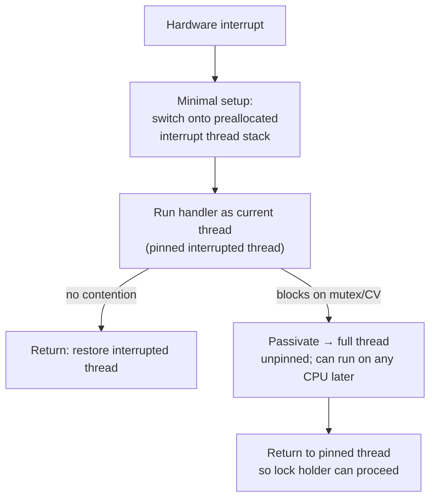

| Optimization | Detail |
|---|---|
| Preallocate interrupt threads | Partly initialized; avoid full create per IRQ |
| Nested interrupts | Interrupt thread can itself be pinned by a higher IRQ thread |
| Block only when needed | Full thread separation cost paid mainly on contention |
| `release_interrupt()` | Continue as a normal high-priority thread; allow IPL to drop |
| “Thread level” | Above this IPL, IRQs are firmware-like (spin only); below → thread model |

### Top half vs bottom half (course view)

| Half | Properties |
|---|---|
| **Top half** | Fast, non-blocking, minimal work; may keep some IRQs masked |
| **Bottom half** | Arbitrary complexity; runs in thread context; can sleep / be scheduled |

### Performance chart (from the paper)

| Cost / benefit | Amount | Notes |
|---|---|---|
| Extra overhead per interrupt | ~**40** SPARC instructions | Always paid to enter interrupt-thread path |
| Savings per mutex enter/exit | ~**12** SPARC instructions | No raise/lower of interrupt level on common path |
| Relative frequency | Mutex ≫ interrupts | Net **win** if interrupt threads rarely block |
| Memory | ~8KB stack+struct per preallocated IRQ thread | Per CPU × levels below thread level (+ one clock thread) |

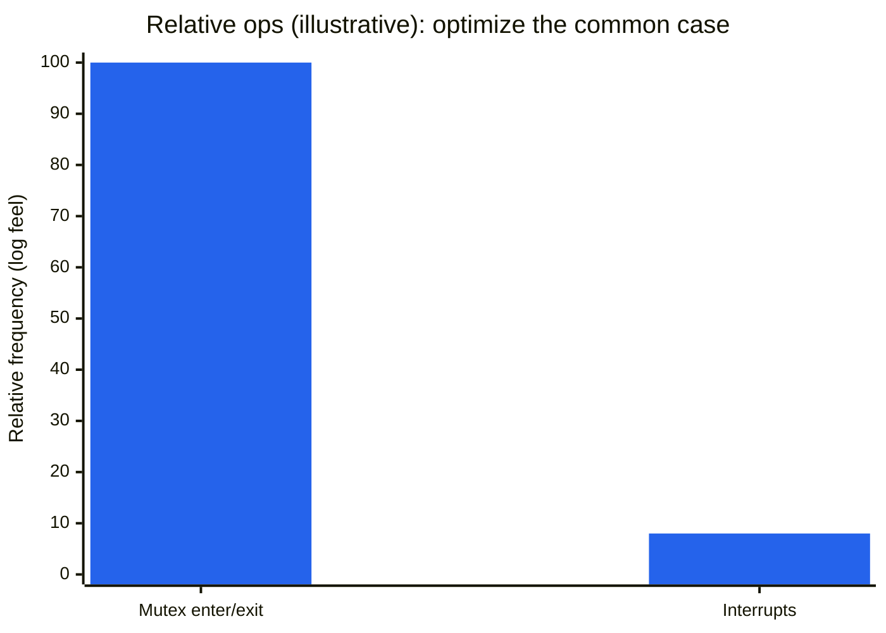

| Rule of thumb | Meaning |
|---|---|
| Optimize the common case | Cheap mutex path matters more than slightly dearer IRQs |
| Convert to “real” thread only on contention | Rare path bears flush/heavy setup (e.g. SPARC register file) |

### Clock interrupt special case

| Design | Why |
|---|---|
| One clock thread for the system | Not one per CPU |
| If clock thread already active | Tick counted; handler clears IRQ; thread repeats work if counter ≠ 0 |
| Rarity | Usually only under heavy higher-IPL load or debugging |

### Synchronization objects in the kernel (same ideas as userland)

| Primitive | Role |
|---|---|
| Mutex | Exclusive critical sections; adaptive by default |
| Condition variable | Wait for state change (`cv_wait`, `_sig`, `_timedwait`) |
| RW lock | Multiple readers / one writer |
| Semaphore | Counting |

| Mutex type (SunOS) | Behavior |
|---|---|
| `MUTEX_DEFAULT` (adaptive) | Spin while owner runs; else sleep |
| `MUTEX_SPIN` | Spin; disable interrupts to given level while held |
| `MUTEX_DRIVER` | Driver-safe; adaptive vs spin from interrupt priority vs thread level |

**Turnstiles:** sleep-queue headers live outside the sync object (2-byte cookie → turnstile) for predictable real-time behavior vs hashed sleep queues.

---

## 7. Threads and Signal Handling

UL and KL each have a signal mask. Updating only the UL mask is cheap but **invisible** to the kernel — so delivery needs library ↔ kernel cooperation.

| Case | KL mask | UL masks | What should happen |
|---|---|---|---|
| **1** | Enabled | Enabled on current ULT | Deliver normally — no conflict |
| **2** | Enabled | Disabled on current ULT, enabled on another | Kernel thinks OK; library must redirect / handle so the right ULT sees it |
| **3** | Enabled on multiple KLTs | Mixed UL masks | Library resolves which ULT should take the signal |
| **4** | Enabled | **All** ULTs disabled | Library issues syscall to disable at KL; may propagate disable to other KLTs; re-enable later when some ULT unmasks |

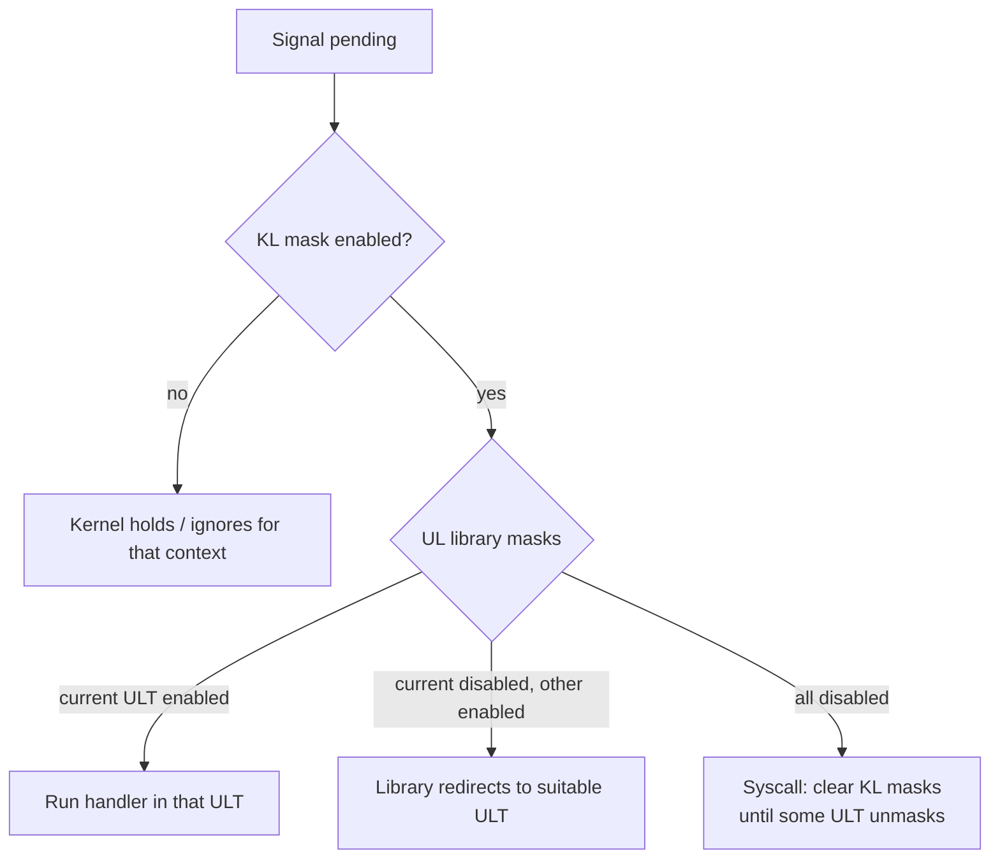

### One-shot vs realtime signals

| Kind | Semantics |
|---|---|
| **One-shot (classic)** | Multiple raises while pending may coalesce; old `signal()` often reset to default after delivery |
| **Realtime signals** | Queued: *n* raises → handler runs *n* times (with more info) |

### Optimize the common case (signals)

| Observation | Design choice |
|---|---|
| Mask updates ≫ actual signals | Prefer updating **UL** mask without syscalls |
| Actual delivery is rarer / heavier | Pay kernel coordination when a signal really arrives |

---

## 8. Linux: `task_struct`, `clone`, NPTL

Linux’s main execution abstraction is a **task**.

| Process shape | Tasks |
|---|---|
| Single-threaded process | 1 task |
| Multithreaded process | Multiple tasks sharing selected resources |

```c
struct task_struct {
    pid_t pid;              /* unique task id */
    pid_t tgid;             /* thread-group id ≈ "process id" to users */
    struct files_struct *files;
    struct mm_struct *mm;
    struct list_head tasks; /* linkage among tasks */
    /* ... */
};
```

| Field | Single-thread | Multi-thread |
|---|---|---|
| `pid` | Equals `tgid` | Differs per task |
| `tgid` | Process id | Shared “process” id (`getpid()`) |
| `mm` / `files` | Private to the process | Typically shared among threads |

### `clone` sharing flags

```text
clone(function, stack_ptr, sharing_flags, args)
```

| Flag | Effect |
|---|---|
| `CLONE_VM` | Share address space → thread-like |
| `CLONE_FS` | Share root / cwd / umask |
| `CLONE_FILES` | Share file descriptor table |
| `CLONE_SIGHAND` | Share signal handler table |
| `CLONE_PARENT` | Same parent as caller |
| (historical) `CLONE_PID` | New thread keeps old PID (old LinuxThreads era ideas) |

`fork()` ≈ `clone` with sharing flags cleared → child is a full copy. After `fork` in a multithreaded parent, the child is typically **single-threaded** in the copied address space — mutex state can be awkward (only the forking thread exists in the child).

### NPTL vs older LinuxThreads

| | **NPTL** (modern) | Older **LinuxThreads** |
|---|---|---|
| Model | **1:1** | M:N-ish / manager-thread issues |
| Kernel visibility | Kernel sees each pthread | Similar visibility gaps to Solaris M:N papers |
| Traps / futexes | Cheaper kernel paths; futex-based sync | Heavier / less POSIX-faithful |
| Resources | Needs memory + large ID spaces | Fewer KL entities, more edge cases |

---

## 9. SunOS 5.0 Takeaways (Eykholt summary)

| Feature | Why it mattered |
|---|---|
| Fully preemptible kernel | Bounded dispatch latency for real-time |
| Symmetric multiprocessing | High concurrency on shared-memory MP |
| User threads on LWPs | Thousands of ULTs without thousands of kernel stacks always |
| Interrupts as threads | Normal sync; no IPL tax on every mutex |
| Adaptive mutexes | Spin only while owner is running |
| Data-based locking | Every shared datum has a sync object |
| Priority inheritance | Reduce unbounded priority inversion |

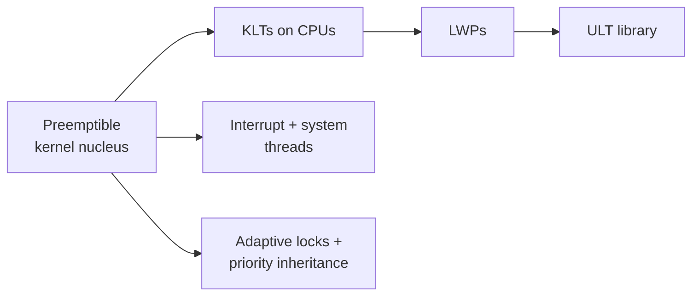

### Papers to read

| Paper | Focus |
|---|---|
| [Eykholt et al. — Multithreading the SunOS Kernel](https://s3.amazonaws.com/content.udacity-data.com/courses/ud923/references/ud923-eykholt-paper.pdf) | Kernel threads, interrupts-as-threads, adaptive mutexes, MT data structures |
| [Stein & Shah — Implementing Lightweight Threads](https://s3.amazonaws.com/content.udacity-data.com/courses/ud923/references/ud923-stein-shah-paper.pdf) | User-level library: scheduling, death row, UL↔KL interactions |

---

## Quick Review Checklist

| Question | Short answer |
|---|---|
| What does the kernel schedule? | Kernel threads (onto CPUs) |
| What does the UL library schedule? | ULTs onto LWPs/KLTs |
| Why split PCB? | Share heavy state; switch light state; scale |
| Why interrupts-as-threads? | Use normal locks; avoid IPL on every mutex |
| Adaptive mutex? | Spin while owner runs; else sleep |
| Hardest UL↔KL issue? | Lack of visibility (blocking, priorities, masks) |
| Linux threads today? | NPTL 1:1 via `clone` + shared `mm`/`files`/sighand |
