# P2L5 — Thread Performance & Web Server Architectures

## Overview

Earlier lessons covered *how* threads work. This lesson asks **when threads help performance** — and when another concurrency model wins.

Primary reference: Vivek S. Pai, Peter Druschel, Willy Zwaenepoel, *[Flash: An Efficient and Portable Web Server](https://s3.amazonaws.com/content.udacity-data.com/courses/ud923/references/ud923-pai-paper.pdf)* (USENIX ATC 1999). Rice University. Introduces the **AMPED** architecture and the Flash server.

| Topic | What you should take away |
|---|---|
| Why threads help | Parallelism, specialization (hot caches), cheaper async, latency hiding |
| Performance metrics | What to measure, how to build a fair testbed |
| Concurrency architectures | MP, MT, SPED, AMPED — tradeoffs |
| Flash web server | AMPED + aggressive caching; portable high performance |
| Evaluation facts | Flash matches/beats SPED on cache hits and MP/MT on disk-bound loads; up to **50%** over Apache, **~30%** over Zeus |

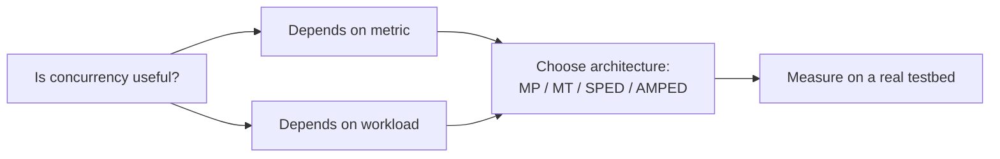

> **Interesting fact:** Flash was evaluated by rebuilding **four architectures from the same codebase** (Flash-AMPED, Flash-MT, Flash-MP, Flash-SPED). That isolates *architecture* effects from *implementation quality* — a rare and clean experimental design.

---

## 1. Why Threads Are Useful

| Benefit | Intuition |
|---|---|
| **Parallelization** | Overlap work across CPUs / hide I/O wait |
| **Specialization** | Pin a thread to a role → hotter caches, better locality |
| **Efficiency** | Shared address space → lower memory than processes; cheaper async than process-per-request |
| **Latency hiding** | While one thread blocks on I/O, another runs |

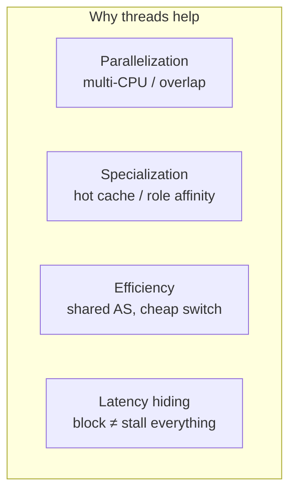

### Boss-worker vs pipeline

| Model | Structure | Strength |
|---|---|---|
| **Boss-worker** | One dispatcher assigns whole requests to workers | Simple; good load balance across independent requests |
| **Pipeline** | Request flows through specialized stage threads | Often **shorter total execution time** (stages stay hot); avg stage latency can look worse |

Pipeline trades stage-local averages for end-to-end speed via specialization.

---

## 2. Performance Metrics

A **metric** is a measurable / quantifiable property used to evaluate system behavior.

| Metric | Typical unit / meaning |
|---|---|
| Execution time | Latency of a request / job |
| Throughput / bandwidth | Bytes (or work) per unit time |
| Connection / request rate | Connections or requests per second |
| CPU utilization | Fraction of CPU busy |
| Wait / idle time | Time blocked or not useful |
| Platform efficiency | Useful work / resource used |
| Performance / $ | Throughput per dollar |
| Performance / W | Throughput per watt |
| SLA violation % | Fraction of requests missing a deadline |

### How you obtain metrics

Prefer experiments with **real software, real machines, real workloads**. If not possible: toy / simulated experiments that still represent a realistic setting.

These experimental settings are the **testbed**.

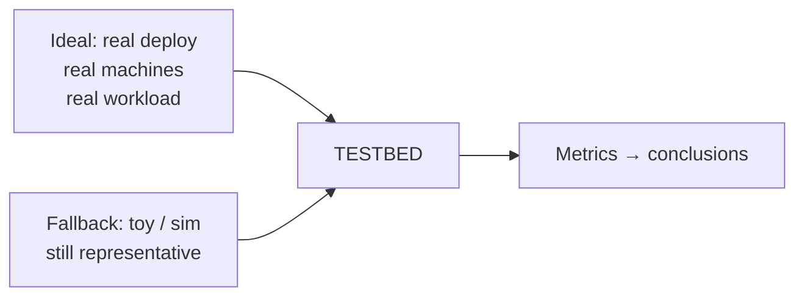

> **Are threads “really useful”?** It depends on (1) which metrics you care about and (2) the workload. Different toy-shop order mixes → different best implementations; different graphs → different shortest-path algorithms; different file patterns → different filesystems.

---

## 3. Web Server Request Pipeline

A simple static HTTP/1.0 request on a UNIX-like OS goes through these steps (all can potentially **block**):

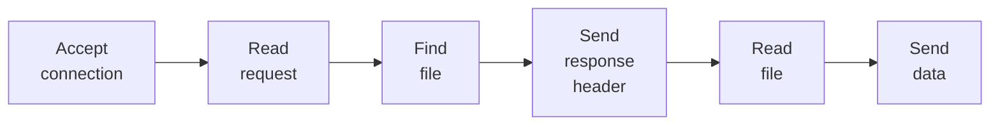

| Step | What can block |
|---|---|
| Accept connection | No client yet / listen backlog |
| Read request | Client data not arrived |
| Find file (`stat` / `open`) | Disk metadata I/O |
| Send response header | TCP send buffer full |
| Read file | Disk read / page fault |
| Send data | Network capacity / full buffers |

For large files, **Read file ↔ Send data** repeat until done.

High performance requires **interleaving** many requests so CPU, disk, and network overlap. The **server architecture** chooses how that interleaving happens.

---

## 4. Concurrency Architectures Compared

### 4.1 Multi-process (MP)

Each process handles **one request at a time**, end-to-end. Typically **20–200** processes. OS context-switches on block → natural overlap of disk / CPU / network.

| Pros | Cons |
|---|---|
| Simple programming model | High memory (full process per request) |
| No user-level sync across requests | Costly context switches |
| Crash isolation per process | Hard / costly shared state (caches) |
| | Tricky listen-port / accept sharing |

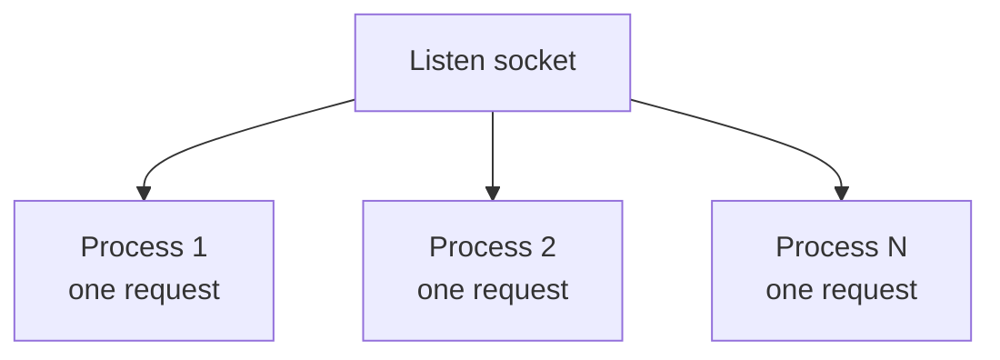

**Apache (UNIX historically):** MP architecture — each process is essentially a boss/worker with a dynamic pool; process count can auto-adjust. (On Windows NT, Apache used MT.)

### 4.2 Multi-threaded (MT)

Many threads in **one shared address space**. Each thread still owns one request, like MP — but sharing is easy.

| Pros | Cons |
|---|---|
| Shared caches / state | Needs synchronization |
| Cheaper switches than processes | Needs **kernel threads** (user-only threads fail on blocking I/O) |
| Lower memory than MP | Long-lived connections still hold a whole thread |

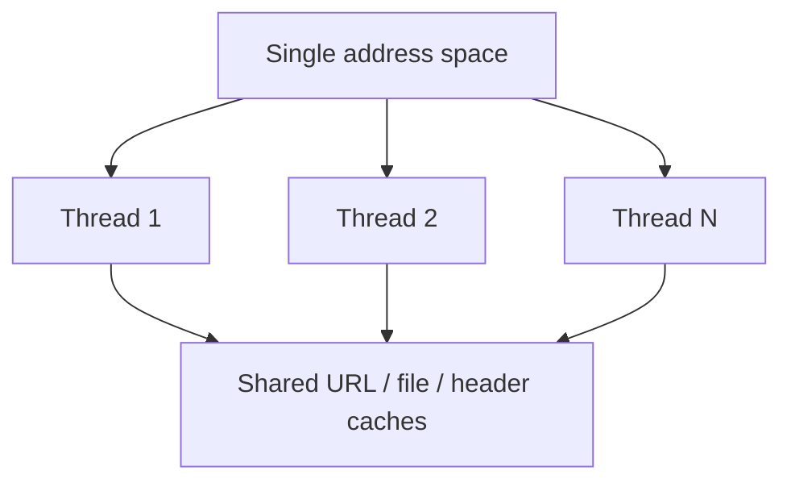

> **Paper fact:** FreeBSD 2.2.6 had only user-level threads — Flash-MT results could not be reported there. MT servers need the kernel to schedule sibling threads when one blocks.

### 4.3 Single-process event-driven (SPED)

One process, one thread of control, **state machine** driven by I/O events.

| Idea | Detail |
|---|---|
| Dispatcher | `select` / `poll` / `epoll` → which FD is ready |
| Handler | Run to completion for one step; if would block, start async I/O and return to dispatch loop |
| Events | New connection, send complete, disk/network ready |
| Concurrency | Many requests **interleaved** in one execution context |

| Pros | Cons |
|---|---|
| Tiny memory footprint (one stack) | A **blocking** handler stalls *everything* |
| No thread sync | Many OSes: non-blocking I/O works for **sockets**, not reliably for **disk** |
| No context-switch tax | Hard to use true async disk APIs with `select` |
| Great on **cached** workloads | Only **one** outstanding disk request → no multi-disk / elevator benefits |

**Why it works on 1 CPU with no idle time:** threads that only hide latency waste cycles on context switches. Event-driven processes a request until wait is needed, then switches to another — without a full thread switch.

**Multi-CPU:** run multiple SPED processes (Zeus often configured this way).

**Zeus:** classic high-performance SPED server (can use multiple SPED processes, especially on multiprocessors).

### 4.4 AMPED / AMTED — helpers for blocking I/O

**Asymmetric Multi-Process Event-Driven (AMPED)** and the threaded variant **AMTED**:

- Main path = event-driven (like SPED)
- **Helpers** = small processes/threads dedicated to **blocking** disk ops
- Comm via pipes/sockets; completion still visible to `select`/`poll`

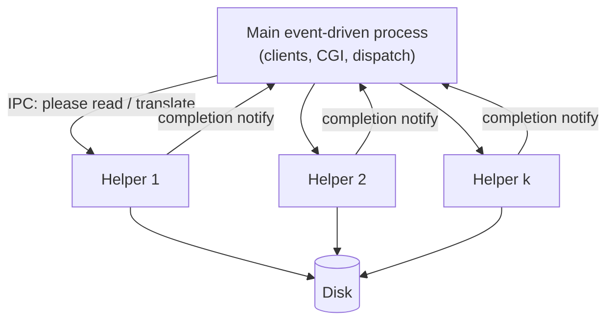

| Pros | Cons |
|---|---|
| Fixes SPED’s “disk blocks the world” problem | Extra IPC cost to helpers |
| Still small footprint vs full worker-per-request | Best for apps that fit the model |
| Portable: only standard UNIX APIs | Event routing on multi-CPU needs care |
| Helpers sized to **concurrent disk ops**, not connections | |

Flash chose **separate helper processes** (not kernel threads) so it stayed portable to OSes without kernel threads (e.g. FreeBSD 2.2.6).

---

## 5. Qualitative Architecture Tradeoffs (from the paper)

### Disk, memory, disk utilization

| Dimension | MP | MT | SPED | AMPED |
|---|---|---|---|---|
| Who blocks on disk | Only that process | Only that thread | **Entire server** | Only helper; main keeps serving |
| Memory cost | High (process × connections) | Medium (thread × connections) | Lowest (1 process) | Low (helpers ≪ connections) |
| Concurrent disk I/Os | Up to #processes | Up to #threads | **1** | Up to #helpers |
| Shared app cache | Hard (IPC / replicate) | Easy (+ locks) | Easy (no locks) | Easy (no locks) |
| Long-lived conn cost | Whole process | Whole thread | FD + small state | FD + small state |

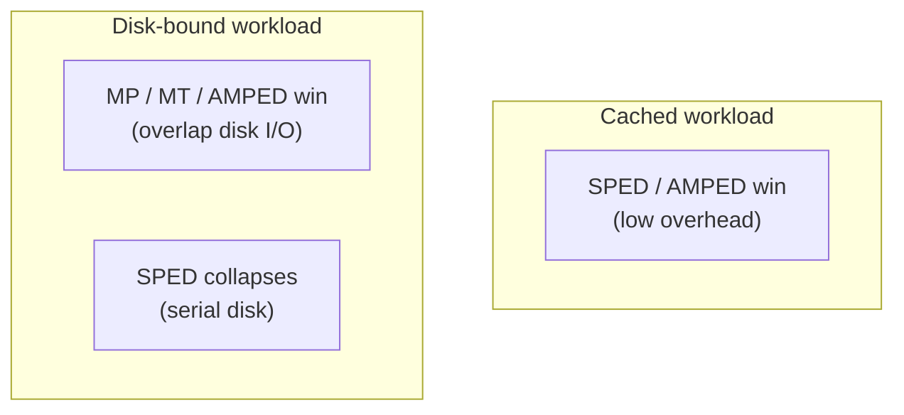

### Optimizations & features

| Feature | MP pain | MT pain | SPED / AMPED |
|---|---|---|---|
| Global stats / accounting | Need IPC to consolidate | Sync or periodic merge | Centralized, cheap |
| App-level caches | Replicated → more misses, more RAM | One cache + locks | One cache, no sync |
| Persistent / slow clients | Hold a full process | Hold a full thread | Hold FD + small conn state |

---

## 6. Flash Web Server (AMPED in practice)

Flash = AMPED + aggressive caching + careful I/O.

### Design sketch

| Piece | Role |
|---|---|
| Main process | All client I/O, CGI, helper control; non-blocking |
| Helpers | Pathname translation + bring disk pages into memory |
| IPC | Helpers return **completion only** (not file bytes) → less copying |
| `mmap` + `mincore` | Map file; test if pages already resident before sending |

**Hot path savings:** dispatcher uses `mincore` — if pages are in RAM, handle locally; else hand off to a helper. Avoids unnecessary IPC on cache hits.

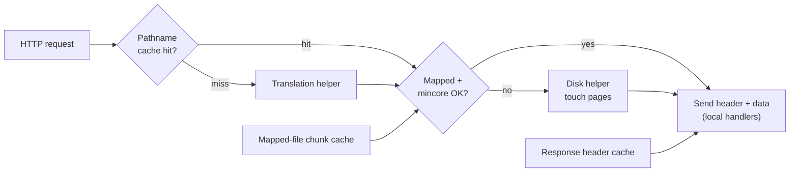

### Flash caches

| Cache | What it stores | Why it helps |
|---|---|---|
| **Pathname translation** | URL / filename → real path on disk | Avoids `stat`/lookup helpers on every request; paper: largest single optimization win |
| **Response header** | Prebuilt HTTP headers for hot files | Invalidated when mapping cache sees file change |
| **Mapped files** | `mmap` chunks (small file = 1 chunk; large = many) | Avoid map/unmap syscalls; LRU free list; only map what’s likely resident |

### Other Flash optimizations

| Optimization | Idea |
|---|---|
| Byte / DMA alignment | Pad response headers to **32-byte** multiples so `writev` copies stay aligned (word + cache-line friendly) |
| `writev` / vector I/O | Header + file regions in one syscall |
| Scatter-gather DMA | Less copying in the NIC path |
| Persistent CGI | Fork once, reuse via pipe (FastCGI-like) so dynamic work doesn’t block the server |

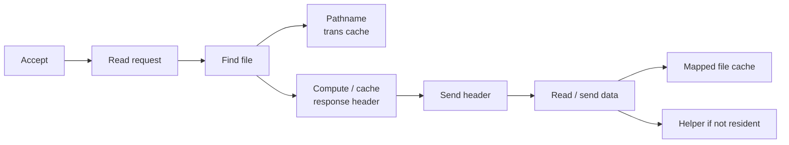

### Apache (comparison point)

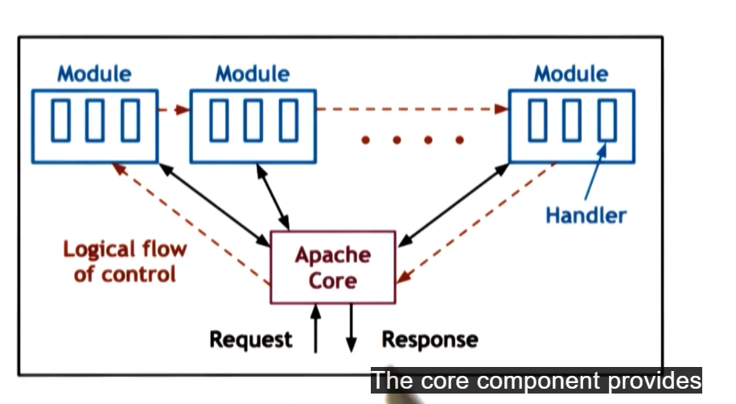

| Piece | Role |
|---|---|
| Apache core | Request / response handling |
| Modules | Each request flows through the module pipeline |
| Concurrency | Historically **MP on UNIX**, **MT on Windows**; often boss/worker pools with auto-sized process/thread counts |

---

## 7. Setting Up a Fair Performance Comparison

Ask three questions:

1. **What systems** are you comparing?
2. **What workloads** will you use?
3. **How** will you measure?

### Systems in the Flash paper

| Server | Architecture / notes |
|---|---|
| Flash | AMPED (production design) |
| Flash-MT | Same code, MT dispatch (64 threads in tests) |
| Flash-MP | Same code, MP (32 processes); **smaller per-process caches** (4 MB map / 200 path entries vs 128 MB / 6000 shared) |
| Flash-SPED | Same code, pure SPED |
| Zeus v1.30 | SPED (1 process on synthetic; **2 processes** on real traces, per vendor advice) |
| Apache v1.3.1 | MP |

**Hardware (paper):** 333 MHz Pentium II, **128 MB** RAM, multiple 100 Mbit/s Ethernet, switched Fast Ethernet. OSes: **Solaris 2.6** and **FreeBSD 2.2.6**.

### Workloads

| Type | Purpose | Examples in paper |
|---|---|---|
| Synthetic / controlled | Peak capacity, reproducible | Same file repeatedly; vary size |
| Trace-based / realistic | Real access distributions over time | Rice **CS** log, **Owlnet** (~4500 users), ECE log truncated to vary dataset size |
| WAN-style concurrency | Many slow concurrent connections | Persistent connections to inflate concurrency in a LAN testbed |

### Primary metrics

| Metric | Definition | vs file size |
|---|---|---|
| **Bandwidth** | Total file bytes transferred / total time | Larger files amortize per-conn cost → **higher** bandwidth |
| **Connection rate** | Total client connections / total time | Larger files → more work per conn → **lower** connection rate |

Paper often reports **output bandwidth (Mb/s)** for realistic traces because truncating logs to change dataset size also changes size mix — bandwidth is more stable than req/s.

---

## 8. Key Experimental Results (paper facts)

### 8.1 Synthetic single-file (fully cached)

- Architecture choice has **little impact** when everything hits memory.
- Flash variants ≈ Zeus; both beat Apache substantially (optimizations matter more than architecture here).
- FreeBSD ≫ Solaris absolute performance (paper: Solaris often **~50% lower**); relative ranking similar.
- Flash-SPED slightly beats Flash-AMPED: AMPED pays for `mincore` residency checks even on hits.
- Zeus anomaly on FreeBSD for **10–100 KB** files attributed to the **byte-alignment / `writev`** issue Flash fixed.

### 8.2 Real traces (Solaris)

| Trace | Character | Architectural lesson |
|---|---|---|
| **CS** | Larger / more disk-intensive | MP competitive; SPED weaker |
| **Owlnet** | Smaller dataset, better locality; smaller avg transfer | SPED looks better; bandwidth still comparable |

**Flash (AMPED) highest throughput on both.** Apache lowest — partly MP, mostly missing Flash-style optimizations (Flash-MP still beats Apache).

### 8.3 Dataset size sweep (working set vs RAM)

As dataset grows past effective cache (~memory), all servers drop; then they are **disk-bound**.

| Observation | Takeaway |
|---|---|
| Flash ≈ Flash-SPED while in-cache | AMPED preserves SPED efficiency |
| Flash ≥ MP/MT when disk-bound | Helpers overlap disk without process-per-connection |
| Flash-SPED / Zeus collapse when disk-heavy | One blocker stalls the event loop |
| Flash-MP weaker in-cache | Replicated small caches → more compulsory misses |
| Flash more memory-efficient than MP | Helpers ≪ connections → more RAM left for FS cache |

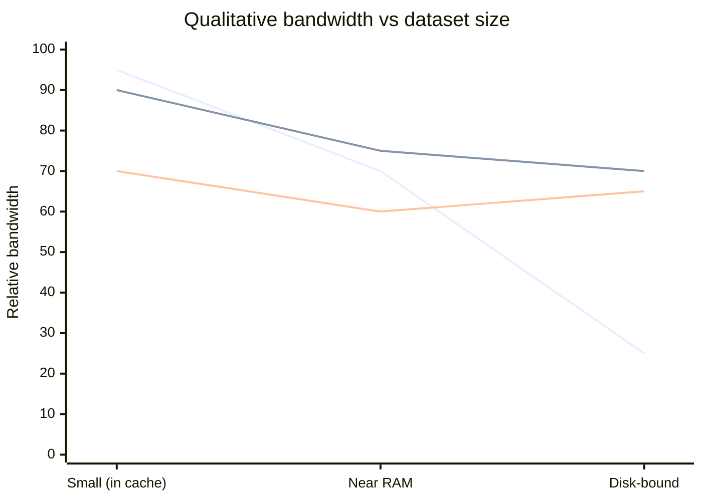

### 8.4 Optimization breakdown (Flash)

On cached small-file traffic, **without optimizations, small-file performance can drop by ~half**.

Relative impact (paper, FreeBSD single-file):

| Optimization | Impact |
|---|---|
| Pathname translation cache | **Largest** benefit |
| Mapped file cache | Significant |
| Response header cache | Significant |
| Combined | Strongest on **small** documents (amortize per-request fixed costs) |

### 8.5 Many concurrent clients (WAN-like)

| Architecture | As concurrency ↑ past ~200 |
|---|---|
| SPED / AMPED | Rise then **flatten** (low per-client cost) |
| MT | Gradual decline (thread switch + space) |
| MP | **Significant decline** (process overhead + fragmented caches) |

> **Headline numbers from the conclusion:** Flash exceeds Zeus by up to **~30%** and Apache by up to **~50%** on real workloads; AMPED nearly matches SPED on cached loads and MP/MT on disk-intensive loads — using only portable APIs.

---

## 9. Cheat Sheet — Which Architecture When?

| Situation | Prefer | Why |
|---|---|---|
| Working set fits in RAM | SPED or AMPED | Lowest overhead, no sync |
| Working set ≫ RAM | AMPED, MT, or MP | Need concurrent disk I/O |
| Need max portability + both regimes | **AMPED (Flash)** | Helpers only where OS async disk is weak |
| Simplest code | MP | No shared-state programming |
| Shared in-memory structures | MT or event-driven | One address space |
| Huge # of slow clients | SPED / AMPED | Don’t pay a thread/process per idle conn |
| Multi-disk / high disk parallelism | MP / MT / AMPED | SPED can issue only one disk op at a time |

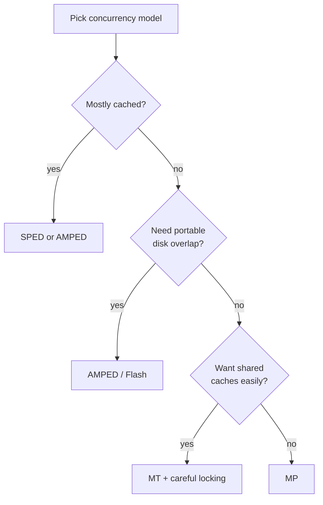

---

## 10. Memory Footprint Intuition

Event-driven needs the **least** memory: extra RAM only for helpers that cover concurrent blocking I/O — not one stack/process per connection.

| Model | Rough memory drivers |
|---|---|
| SPED | 1 process + 1 stack + conn state |
| AMPED | SPED + small helpers × concurrent disk ops |
| MT | Thread stacks × concurrent requests + sync structures |
| MP | Full process image × concurrent requests (+ replicated caches) |

Less server RAM used → more left for the **filesystem page cache** → fewer disk I/Os → higher throughput. That feedback loop is a big reason AMPED beats naive MP on disk-bound traces.

---

## Quick Reference — Paper Vocabulary

| Term | Meaning |
|---|---|
| **SPED** | Single-Process Event-Driven |
| **AMPED** | Asymmetric Multi-Process Event-Driven |
| **AMTED** | Asymmetric Multi-Thread Event-Driven (helpers as threads) |
| **MP / MT** | Multi-Process / Multi-Threaded (one request per process/thread) |
| **`select` / `poll` / `epoll`** | Wait for readiness on many FDs |
| **`mmap` / `mincore`** | Map file into AS; test page residency |
| **`writev`** | Vectored write (header + body without user-level concat) |
| **Testbed** | Machines + OS + workload + measurement setup used for evaluation |

---

## Sources

1. Pai, Druschel, Zwaenepoel — *Flash: An Efficient and Portable Web Server*, USENIX ATC 1999. [PDF](https://s3.amazonaws.com/content.udacity-data.com/courses/ud923/references/ud923-pai-paper.pdf)
2. Course lecture notes (P2L5) — threads for performance, metrics, web-server concurrency models, Flash vs Apache evaluation setup.
