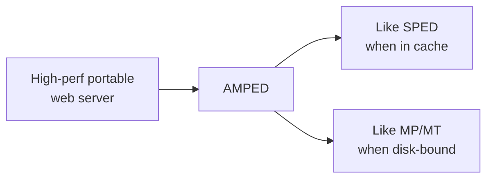
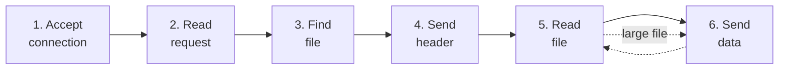
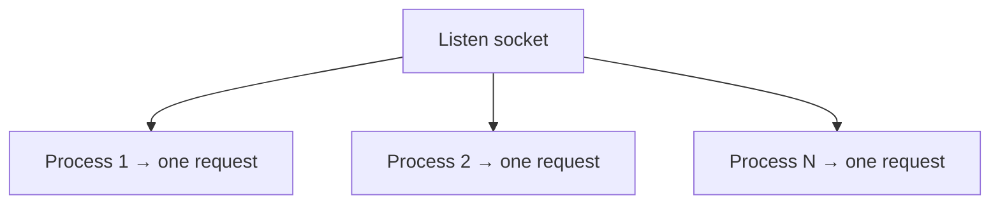
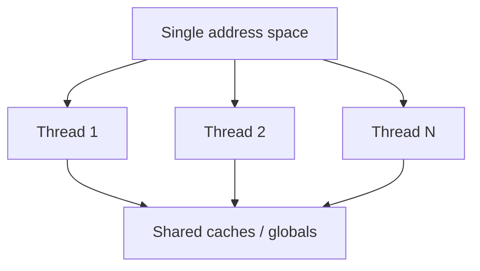
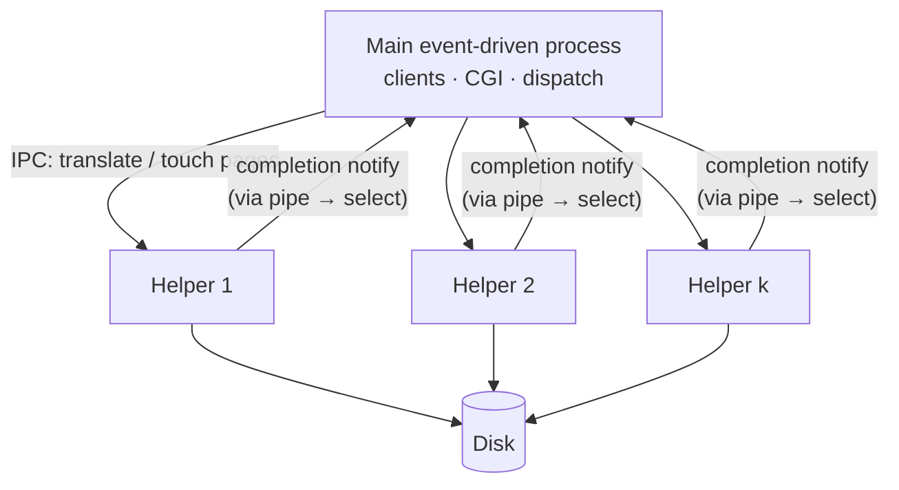
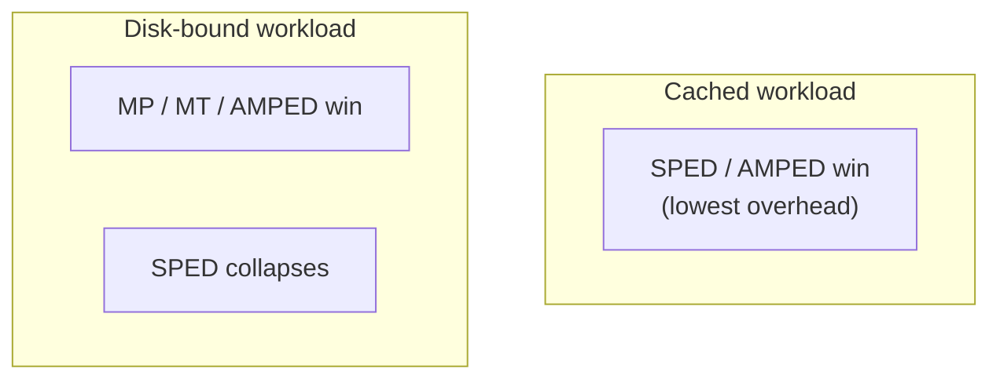
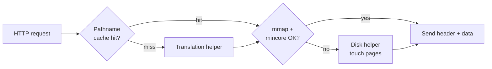
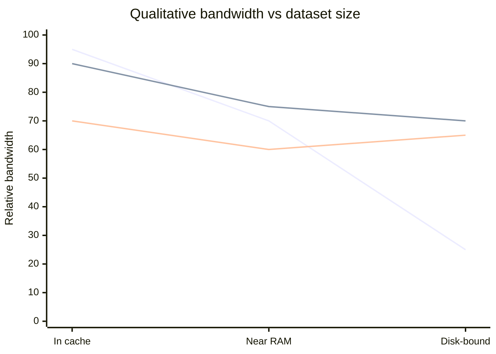
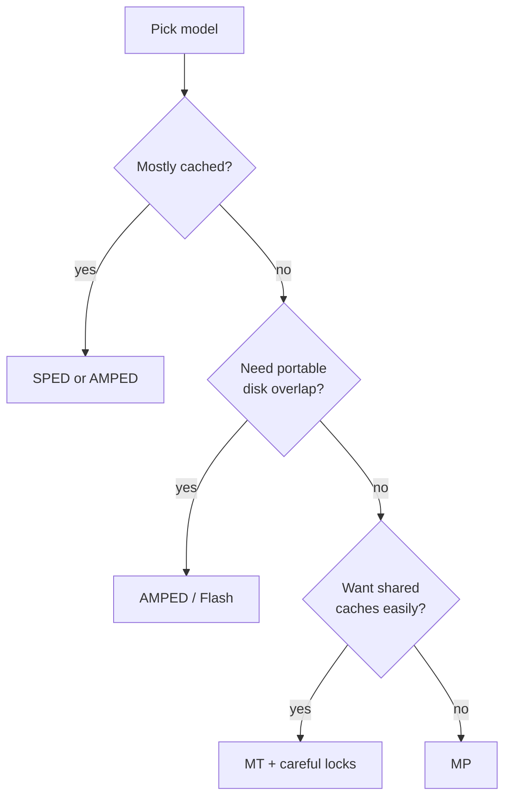

# Flash Paper Notes — Exam Prep

**Paper:** Vivek S. Pai, Peter Druschel, Willy Zwaenepoel — *[Flash: An Efficient and Portable Web Server](https://s3.amazonaws.com/content.udacity-data.com/courses/ud923/references/ud923-pai-paper.pdf)* (USENIX ATC 1999, Rice University)

> **One-line thesis:** AMPED (Flash) nearly matches SPED on *cached* workloads and matches/beats MP/MT on *disk-bound* workloads — using only portable OS APIs.

---

## 0. Exam Snapshot (read this first)

| Item | Remember |
|---|---|
| **Problem** | Web working sets ≫ RAM → must overlap cached serving with disk I/O |
| **New architecture** | **AMPED** = SPED event loop + helper processes for blocking disk |
| **Implementation** | **Flash** = AMPED + aggressive caches + careful I/O |
| **Portability** | Standard APIs only (`select`, non-blocking sockets/pipes, `mmap`, `mincore`) |
| **Fair comparison** | Same codebase → Flash, Flash-SPED, Flash-MT, Flash-MP |
| **Headline results** | Flash ≈ SPED when cached; Flash ≥ MP/MT when disk-bound; up to **~50%** over Apache, **~30%** over Zeus |



---

## 1. Why Architecture Matters

Web servers cache hot content in RAM to hit thousands of req/s. Real datasets still exceed memory, so a server must:

1. Serve **cache hits** with low overhead
2. Overlap those hits with **concurrent disk fetches** for misses

| Architecture family | Classic example | Strength | Weakness |
|---|---|---|---|
| SPED | Zeus, Harvest/Squid | Best when mostly cached | Disk I/O can stall *entire* server |
| MP | Apache (UNIX) | Disk overlap natural | High memory; hard shared caches |
| MT | Apache (Windows NT) | Shared state + overlap | Needs **kernel** threads + locks |
| **AMPED** | **Flash** | Best of both regimes | Extra IPC to helpers |

> **Exam observation:** Architecture alone is not enough — Flash-style *optimizations* (caches, alignment) explain much of Apache’s gap. Flash-MP still beats Apache.

---

## 2. HTTP Request Pipeline (all steps can block)



| Step | Typical blocking cause |
|---|---|
| Accept | No client / backlog |
| Read request | Client data not arrived |
| Find file (`stat`/`open`) | Disk metadata |
| Send header / data | TCP send buffer full |
| Read file | Disk / page fault |

**Architecture = strategy for interleaving many of these pipelines** so CPU, disk, and network overlap.

---

## 3. Four Architectures

### 3.1 Multi-Process (MP)

Each process handles **one request end-to-end**. Typically 20–200 processes. OS switches on block → natural overlap.



| Pros | Cons |
|---|---|
| Simple; no user-level sync across requests | High memory (full process × connections) |
| Crash isolation | Costly context switches |
| | Shared caches need IPC or **replication** |

### 3.2 Multi-Threaded (MT)

Many threads, **one address space**. Same “one request per worker” model as MP, but sharing is easy.



| Pros | Cons |
|---|---|
| Shared caches / stats | Needs locks |
| Cheaper than processes | Requires **kernel threads** |
| | Long-lived conn holds a whole thread |

> **Paper fact:** FreeBSD 2.2.6 had only user-level threads → **Flash-MT results could not be reported**. If one thread blocks and siblings aren’t scheduled, MT fails.

### 3.3 Single-Process Event-Driven (SPED)

One process, one thread: a **state machine** driven by `select`/`poll`.


| Pros | Cons |
|---|---|
| Tiny footprint; no sync; no thread switches | **Any blocking call stalls everything** |
| Excellent on cached loads | Many OSes: non-blocking works for **sockets**, not **disk files** |
| | Only **one** outstanding disk op → no multi-disk benefit |

**SPED failure mode:** `read()` on a disk FD may still block even if marked non-blocking. True async disk APIs often don’t integrate cleanly with `select`.

### 3.4 AMPED (Asymmetric Multi-Process Event-Driven)

**SPED main loop + helper processes for blocking disk work.**



| Idea | Detail |
|---|---|
| Default path | Main process handles all HTTP steps (like SPED) |
| Disk miss | Main asks helper via IPC (pipe); helper may block |
| Completion | Helper notifies; main sees it via `select` like any other I/O |
| APIs used | Non-blocking socket/pipe I/O, `select`, `mmap`, `mincore` |
| Helpers as processes | Chosen for **portability** (works without kernel threads) |

**Why `mmap` helps:** helper and main both map the file; helper *touches* pages to pull them into RAM; helper returns **notification only** (not file bytes) → less IPC/copying.

> **Core insight:** AMPED preserves SPED efficiency except when disk is needed; then it behaves like MP/MT for overlap — without a process/thread per connection.

---

## 4. Qualitative Tradeoffs (memorize this table)

| Dimension | MP | MT | SPED | AMPED |
|---|---|---|---|---|
| Who blocks on disk | That process only | That thread only | **Entire server** | Helper only; main keeps serving |
| Memory cost | Highest (process × conns) | Medium (thread × conns) | Lowest | Low (helpers ≪ conns) |
| Concurrent disk I/Os | ≤ #processes | ≤ #threads | **1** | ≤ #helpers |
| Shared app cache | Hard / replicate | Easy + locks | Easy, no locks | Easy, no locks |
| Long-lived / slow client cost | Whole process | Whole thread | FD + small state | FD + small state |
| Info gathering / stats | IPC to merge | Sync or merge | Centralized | Centralized |



### Feature cost by architecture

| Feature | MP pain | MT pain | SPED / AMPED |
|---|---|---|---|
| Global accounting | IPC consolidate | Locks / per-thread merge | Centralized, cheap |
| App-level caches | Replicated → more misses, more RAM | One cache + sync | One cache, no sync |
| Persistent / modem clients | Hold full process | Hold full thread | Hold FD + conn state |

> **Memory → cache feedback:** Less server RAM used → more left for **filesystem page cache** → fewer disk I/Os → higher throughput. Big reason AMPED beats naive MP on disk-bound traces.

---

## 5. Flash Implementation

**Flash = AMPED + aggressive caching + careful I/O.**

### 5.1 Structure

| Piece | Role |
|---|---|
| Main process | All client I/O, CGI, helper control; non-blocking |
| Helpers | Pathname translation + bring disk pages into memory |
| Helper lifecycle | Dynamically spawned; kept in reserve; one request at a time; sync wait |
| IPC policy | Return **completion only**, not file content |



### 5.2 Three caches

| Cache | Stores | Why it helps |
|---|---|---|
| **Pathname translation** | URL/filename → real disk path | Avoids helper/`stat` on every request; **largest single optimization win** |
| **Response header** | Prebuilt HTTP headers for hot files | Regenerated when mapping cache detects file change |
| **Mapped files** | `mmap` **chunks** (small file = 1; large = many) | Cuts map/unmap syscalls; LRU free list; `mincore` before use |

### 5.3 Other optimizations

| Optimization | Idea |
|---|---|
| Byte-position alignment | Pad headers to **32-byte** multiples so `writev` kernel copies stay aligned (word + cache-line) |
| `writev` | Send header + body regions in one syscall |
| Persistent CGI | Fork once, reuse via pipe (FastCGI-like); dynamic work can’t stall main server |
| `mincore` / `mlock` fallback | Test residency; or lock pages; or clock heuristic if OS lacks both |

> **Zeus anomaly explained:** On FreeBSD, Zeus dipped for **10–100 KB** files — attributed to the **writev misalignment** bug Flash’s 32-byte padding fixes.

---

## 6. Experimental Setup (know for “how did they evaluate?”)

### Systems compared

| Server | Architecture | Config notes |
|---|---|---|
| Flash | AMPED | 128 MB map cache, 6000 path entries |
| Flash-SPED | SPED | Same code, no helpers |
| Flash-MT | MT | 64 threads |
| Flash-MP | MP | 32 processes; **smaller** caches (4 MB / 200 paths) — replicated |
| Zeus v1.30 | SPED | 1 process (synthetic); **2 processes** (real traces, vendor advice) |
| Apache v1.3.1 | MP | Reference production server |

**Hardware:** 333 MHz Pentium II, **128 MB** RAM, 100 Mbit Ethernet, switched. OSes: **Solaris 2.6**, **FreeBSD 2.2.6**.

### Workloads & metrics

| Workload | Purpose |
|---|---|
| Synthetic single-file (vary size) | Peak cached capacity |
| Trace replay (CS, Owlnet, ECE) | Realistic locality / size mix |
| Dataset-size sweep | Transition from cache-bound → disk-bound |
| Many concurrent clients (persistent) | WAN-like concurrency on LAN testbed |

| Metric | Notes |
|---|---|
| Output **bandwidth** (Mb/s) | Preferred for traces (size mix changes with truncation) |
| Connection / request rate | Dominant for small files |

---

## 7. Key Results (exam observations)

### 7.1 Synthetic single-file (fully cached)

| Observation | Takeaway |
|---|---|
| Architecture has **little impact** | Everything is in memory |
| Flash ≈ Zeus ≫ Apache | Optimizations dominate over architecture |
| FreeBSD ≫ Solaris (~**50%** higher) | OS matters a lot; relative ranks similar |
| Flash-SPED **slightly >** Flash | AMPED pays `mincore` cost even on hits |
| Flash-MT / Flash-MP slightly behind | Extra kernel / switch overhead |

### 7.2 Real traces (Solaris)

| Trace | Character | Lesson |
|---|---|---|
| **CS** | Larger, more disk-intensive | MP competitive; pure SPED weaker |
| **Owlnet** | Smaller dataset, better locality | SPED looks better |

**Flash (AMPED) highest on both.** Apache lowest — mostly missing Flash optimizations (Flash-MP still wins vs Apache).

### 7.3 Dataset size sweep (working set vs RAM)

As dataset grows past effective cache → all drop → **disk-bound**.

| Observation | Takeaway |
|---|---|
| Flash ≈ Flash-SPED while in-cache | AMPED preserves SPED efficiency |
| Flash ≥ MP/MT when disk-bound | Helpers overlap disk without process-per-conn |
| Flash-SPED / Zeus collapse when disk-heavy | One blocker stalls the event loop |
| Flash-MP weaker in-cache | Small replicated caches → more compulsory misses |
| Flash more memory-efficient than MP | Helpers sized to **disk concurrency**, not connections |



### 7.4 Optimization breakdown

Without Flash’s caches, **small-file performance can drop by ~half**.

| Optimization | Relative impact |
|---|---|
| Pathname translation cache | **Largest** |
| Mapped file cache | Significant |
| Response header cache | Significant |
| Combined | Strongest on **small** docs (amortize fixed per-request cost) |

### 7.5 Many concurrent clients (WAN-like)

| Architecture | As concurrency ↑ past ~200 |
|---|---|
| SPED / AMPED | Rise then **flatten** (low per-client cost) |
| MT | Gradual decline (thread overhead) |
| MP | **Significant decline** (process + fragmented caches) |

> **Conclusion numbers:** Flash exceeds Zeus by up to **~30%** and Apache by up to **~50%** on real workloads.

---

## 8. Cheat Sheet — Which Architecture When?

| Situation | Prefer | Why |
|---|---|---|
| Working set fits in RAM | SPED or AMPED | Lowest overhead |
| Working set ≫ RAM | AMPED, MT, or MP | Need concurrent disk I/O |
| Portable + good in *both* regimes | **AMPED (Flash)** | Helpers only where async disk is weak |
| Simplest code | MP | No shared-state programming |
| Shared in-memory structures | MT or event-driven | One address space |
| Huge # of slow clients | SPED / AMPED | Don’t pay thread/process per idle conn |
| Multi-disk parallelism | MP / MT / AMPED | SPED issues only one disk op |



---

## 9. Vocabulary (quick lookup)

| Term | Meaning |
|---|---|
| **SPED** | Single-Process Event-Driven |
| **AMPED** | Asymmetric Multi-Process Event-Driven |
| **AMTED** | Helpers as threads (threaded AMPED variant) |
| **MP / MT** | Multi-Process / Multi-Threaded (one request per worker) |
| **`select` / `poll`** | Multiplex readiness on many FDs |
| **`mmap` / `mincore`** | Map file; test if pages are resident |
| **`writev`** | Vectored write (header + body) |
| **Helper** | Process that blocks on disk so the main event loop doesn’t |

---

## 10. Likely Exam Questions & Short Answers

**Q1. Why does SPED fail on disk-bound workloads on typical UNIX?**  
Non-blocking I/O works for sockets/pipes, but disk `read`/`open`/`stat` may still block the single process → all request processing stops. Async disk APIs often don’t integrate with `select`.

**Q2. How does AMPED fix that without abandoning the event model?**  
Main process stays event-driven; helpers perform blocking disk ops and notify via IPC. Main learns completion through `select`.

**Q3. Why helpers as processes, not threads, in Flash?**  
Portability — OSes without kernel threads (e.g. FreeBSD 2.2.6) cannot run a correct MT server.

**Q4. Why is Flash more memory-efficient than MP under many connections?**  
Helpers scale with **concurrent disk ops**, not connections. Saved RAM goes to the FS page cache.

**Q5. Name Flash’s three caches and which helped most.**  
Pathname translation, response header, mapped files. **Pathname translation** had the largest benefit.

**Q6. Why rebuild four architectures from one codebase?**  
Isolate concurrency-architecture effects from implementation quality / optimization differences.

**Q7. Cached vs disk-bound: who wins?**  
Cached → SPED/AMPED. Disk-bound → AMPED/MP/MT; pure SPED collapses. Flash aims to win (or tie) in **both**.

**Q8. Cost of a long-lived connection?**  
SPED/AMPED: FD + small state. MP/MT: entire process/thread for the connection’s lifetime.

---

## 11. One-Page Mental Model

```text
                    ┌─────────────────────────┐
   Cached hit  ───► │  Main event loop (SPED) │ ───► send
                    └───────────┬─────────────┘
                                │ miss / not resident
                                ▼
                         Helper processes
                         (may block on disk)
                                │
                                ▼ notify via pipe
                    ┌─────────────────────────┐
                    │  select sees completion │
                    └─────────────────────────┘
```

| Regime | Flash behaves like |
|---|---|
| Hot cache | SPED (helpers mostly idle) |
| Cold / large working set | MP/MT for disk overlap (via helpers) |

---

## Sources

1. Pai, Druschel, Zwaenepoel — *Flash: An Efficient and Portable Web Server*, USENIX ATC 1999. [PDF](https://s3.amazonaws.com/content.udacity-data.com/courses/ud923/references/ud923-pai-paper.pdf)
2. Course notes: `P2L5_thread_performance.md`
